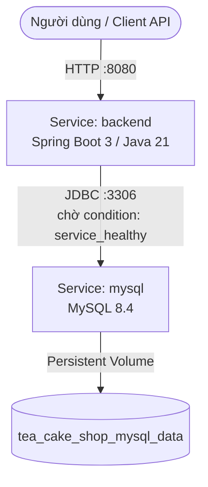

# 🐳 HƯỚNG DẪN ĐÓNG GÓI & TRIỂN KHAI DOCKER - TEA & CAKE SHOP BACKEND

Tài liệu này hướng dẫn chi tiết cách cấu hình, xây dựng (build), khởi chạy (run) và quản lý hệ thống **Tea & Cake Shop Backend** (kèm cơ sở dữ liệu **MySQL 8.4**) bằng **Docker** và **Docker Compose**.

---

## 📋 Mục lục
1. [Yêu cầu hệ thống (Prerequisites)](#1-yêu-cầu-hệ-thống-prerequisites)
2. [Kiến trúc Docker của hệ thống](#2-kiến-trúc-docker-của-hệ-thống)
3. [Hướng dẫn Khởi chạy Nhanh (Quick Start)](#3-hướng-dẫn-khởi-chạy-nhanh-quick-start)
4. [Cấu hình Biến môi trường (.env)](#4-cấu-hình-biến-môi-trường-env)
5. [Các lệnh Docker & Docker Compose thường dùng](#5-các-lệnh-docker--docker-compose-thường-dùng)
6. [Hướng dẫn đẩy Image lên Docker Hub (Push to Docker Hub)](#6-hướng-dẫn-đẩy-image-lên-docker-hub-push-to-docker-hub)
7. [Xử lý sự cố thường gặp (Troubleshooting)](#7-xử-lý-sự-cố-thường-gặp-troubleshooting)

---

## 1. 💻 Yêu cầu hệ thống (Prerequisites)

Để khởi chạy hệ thống bằng Docker, máy tính của bạn cần cài đặt:
- **Docker Desktop** (phiên bản 20.10 trở lên)
- **Docker Compose** (v2.0 trở lên, thường đi kèm trong Docker Desktop)
- Bộ nhớ RAM: Tối thiểu **4 GB** trống (Maven build và Spring Boot trên Java 21 cần tài nguyên nguyên bản).

Kiểm tra cài đặt trong Terminal / Command Prompt / PowerShell:
```bash
docker --version
docker compose version
```

---

## 2. 🏗️ Kiến trúc Docker của hệ thống

Dự án được cấu trúc với **Docker Compose** (`docker-compose.yml`) gồm **2 service chính**:



### 🔹 Service `mysql` (`tea-cake-shop-mysql`)
- **Image**: `mysql:8.4`
- **Port Mapping**: `3307:3306` (Port 3307 trên máy host mapped vào port 3306 của container giúp tránh xung đột với MySQL local).
- **Volume**: `tea_cake_shop_mysql_data:/var/lib/mysql` (Lưu trữ dữ liệu bền vững ngay cả khi container bị xóa hoặc khởi động lại).
- **Healthcheck**: Sử dụng `mysqladmin ping` tự động kiểm tra mỗi 10 giây để đảm bảo database sẵn sàng trước khi khởi chạy ứng dụng Spring Boot.

### 🔹 Service `backend` (`tea-cake-shop-backend`)
- **Build**: Sử dụng **Multi-Stage Build** trong `Dockerfile`:
  - **Stage 1 (Build)**: Dùng `maven:3.9-eclipse-temurin-21` để tải dependencies (`mvn dependency:go-offline`) và đóng gói ra file JAR (`app.jar`).
  - **Stage 2 (Run)**: Dùng `eclipse-temurin:21-jre` siêu nhẹ, chỉ copy file JAR sang để chạy ứng dụng, giúp giảm tối đa dung lượng image và tăng độ bảo mật.
- **Port Mapping**: `${SERVER_PORT:-8080}:8080` (Mặc định 8080).
- **Depends On**: Chờ `mysql` đạt trạng thái `service_healthy` mới khởi chạy kết nối JDBC.

---

## 3. 🚀 Hướng dẫn Khởi chạy Nhanh (Quick Start)

### Bước 1: Tạo file cấu hình môi trường `.env`
Sao chép file `.env.example` thành `.env` tại thư mục gốc (`teacakeshop`):
```bash
# Trong PowerShell / Terminal tại thư mục chứa docker-compose.yml
cp .env.example .env
```

*(Mặc định, các thông số trong `.env.example` đã được thiết lập sẵn sàng để kết nối giữa 2 container trong Docker network).*

### Bước 2: Khởi chạy toàn bộ hệ thống với Docker Compose
Chỉ cần 1 lệnh duy nhất để tự động build image và khởi chạy MySQL + Backend trong chế độ nền (`-d`):
```bash
docker-compose up -d --build
```
*(Nếu dùng Docker bản mới, bạn có thể chạy: `docker compose up -d --build`)*

**Quá trình này diễn ra như sau:**
1. Tải image `mysql:8.4` và `maven:3.9-eclipse-temurin-21`.
2. Khởi tạo container MySQL và thực hiện kiểm tra `healthcheck`.
3. Song song đóng gói Spring Boot bằng Maven bên trong container builder.
4. Khi MySQL `healthy` và JAR đã build xong, container `backend` khởi chạy.

### Bước 3: Kiểm tra trạng thái và Logs
Xem danh sách container đang chạy:
```bash
docker compose ps
```

Xem nhật ký (logs) theo thời gian thực của backend:
```bash
docker compose logs -f backend
```

### Bước 4: Truy cập Ứng dụng & Tài liệu API
Khi log hiển thị `Started TeacakeshopApplication in ... seconds`, bạn có thể truy cập:
- **Tài liệu Swagger UI (OpenAPI 3)**: [http://localhost:8080/swagger-ui.html](http://localhost:8080/swagger-ui.html)
- **OpenAPI JSON Spec**: [http://localhost:8080/api-docs](http://localhost:8080/api-docs)
- **kết nối MySQL từ trình quản lý DB ngoài (DBeaver/Navicat/MySQL Workbench)**:
  - **Host**: `localhost`
  - **Port**: `3307`
  - **Username**: `root`
  - **Password**: `732005` (hoặc mật khẩu bạn cấu hình trong `.env`)
  - **Database**: `tea_cake_shop`

---

## 4. ⚙️ Cấu hình Biến môi trường (`.env`)

Dưới đây là chi tiết các biến trong file `.env` ảnh hưởng trực tiếp đến Docker Compose:

| Biến môi trường | Giá trị mặc định | Mô tả |
| :--- | :--- | :--- |
| `MYSQL_DATABASE` | `tea_cake_shop` | Tên cơ sở dữ liệu được MySQL tự động tạo khi khởi chạy lần đầu. |
| `MYSQL_ROOT_PASSWORD` | `732005` | Mật khẩu tài khoản `root` của MySQL container. |
| `DB_URL` | `jdbc:mysql://mysql:3306/tea_cake_shop?...` | Chuỗi kết nối JDBC cho Spring Boot. Lưu ý hostname phải là `mysql` (tên service trong Docker network). |
| `DB_USERNAME` / `DB_PASSWORD` | `root` / `732005` | Thông tin đăng nhập DB của Spring Boot. |
| `JWT_SECRET` | `replace_with_base64_encoded_32_byte_secret` | Khóa bí mật JWT (hệ thống tự động dùng khóa mẫu an toàn nếu không đổi). |
| `JWT_EXPIRATION_SECONDS` | `900` | Thời gian sống của Access Token (15 phút). |
| `REFRESH_TOKEN_EXPIRATION_SECONDS` | `2592000` | Thời gian sống của Refresh Token (30 ngày). |
| `CLOUDINARY_CLOUD_NAME` | `ojojucnl` | Tên Cloudinary cloud để lưu hình ảnh sản phẩm. |
| `CLOUDINARY_API_KEY` / `API_SECRET` | `...` | Khóa API Cloudinary. |
| `JPA_DDL_AUTO` | `update` | Tự động cập nhật bảng DB khi Entity thay đổi (`update` hoặc `validate`). |
| `SERVER_PORT` | `8080` | Cổng dịch vụ Backend mở ra bên ngoài. |

---

## 5. 🛠️ Các lệnh Docker & Docker Compose thường dùng

### Dừng hệ thống (Không xóa dữ liệu)
```bash
docker compose down
```

### Dừng và xóa toàn bộ dữ liệu database (Reset từ đầu)
Lệnh này xóa cả container, network và **persistent volumes**:
```bash
docker compose down -v
```

### Khởi động lại riêng service Backend (khi bạn vừa cập nhật mã nguồn)
```bash
docker compose up -d --build backend
```

### Xem mức độ sử dụng tài nguyên (CPU, RAM)
```bash
docker stats
```

### Truy cập vào Shell bên trong container Backend
```bash
docker exec -it tea-cake-shop-backend bash
```

### Truy cập vào MySQL CLI bên trong container Database
```bash
docker exec -it tea-cake-shop-mysql mysql -uroot -p732005 tea_cake_shop
```

---

## 6. 🌐 Hướng dẫn đẩy Image lên Docker Hub (Push to Docker Hub)

Nếu bạn muốn đóng gói và chia sẻ image `teacakeshop-backend` lên **Docker Hub** để deploy lên các máy chủ khác (VPS/Cloud):

### Bước 1: Đăng nhập vào tài khoản Docker Hub
```bash
docker login
# Nhập Username và Password/Personal Access Token của bạn
```

### Bước 2: Build image riêng với tag của bạn
Thay `username` bằng tên tài khoản Docker Hub của bạn:
```bash
docker build -t username/teacakeshop-backend:latest -t username/teacakeshop-backend:v1.0.0 .
```

### Bước 3: Đẩy (Push) image lên Docker Hub
```bash
docker push username/teacakeshop-backend:latest
docker push username/teacakeshop-backend:v1.0.0
```

### Bước 4: Chạy ở máy chủ bất kỳ với Docker Hub Image
Trên máy chủ khác, bạn chỉ cần tạo `docker-compose.yml` sửa phần `build: .` thành `image: username/teacakeshop-backend:latest` và chạy `docker compose up -d`.

---

## 7. ⚠️ Xử lý sự cố thường gặp (Troubleshooting)

### ❓ 1. Lỗi `port is already allocated` (Cổng 8080 hoặc 3307 đã bị chiếm)
- **Nguyên nhân**: Trên máy bạn đang có một ứng dụng khác (ví dụ: Tomcat local chạy cổng 8080 hoặc một MySQL khác chạy cổng 3307).
- **Cách khắc phục**:
  - Đổi cổng mapping của Backend trong `.env`: đổi `SERVER_PORT=8081` (khi đó truy cập `http://localhost:8081`).
  - Đổi cổng mapping MySQL trong `docker-compose.yml`: từ `"3307:3306"` thành `"3308:3306"`.

### ❓ 2. Lỗi `Communications link failure` (Backend không kết nối được MySQL)
- **Nguyên nhân**: Chạy backend khi MySQL chưa hoàn tất quá trình khởi tạo initial database.
- **Cách khắc phục**: Trong `docker-compose.yml`, chúng tôi đã tích hợp `healthcheck` cho MySQL (`condition: service_healthy`). Hãy kiên nhẫn đợi 30-40 giây trong lần chạy đầu tiên. Nếu backend bị lỗi, hãy thử khởi động lại riêng nó:
  ```bash
  docker compose restart backend
  ```

### ❓ 3. Lỗi `No space left on device` hoặc hết RAM khi Maven build trong Docker
- **Nguyên nhân**: Docker Desktop bị giới hạn RAM hoặc ổ đĩa bị đầy cache.
- **Cách khắc phục**:
  - Dọn dẹp bộ nhớ đệm Docker: `docker system prune -a --volumes`
  - Tăng cấp phát RAM cho Docker Desktop trong **Settings > Resources > Memory** lên ít nhất `4GB`.
