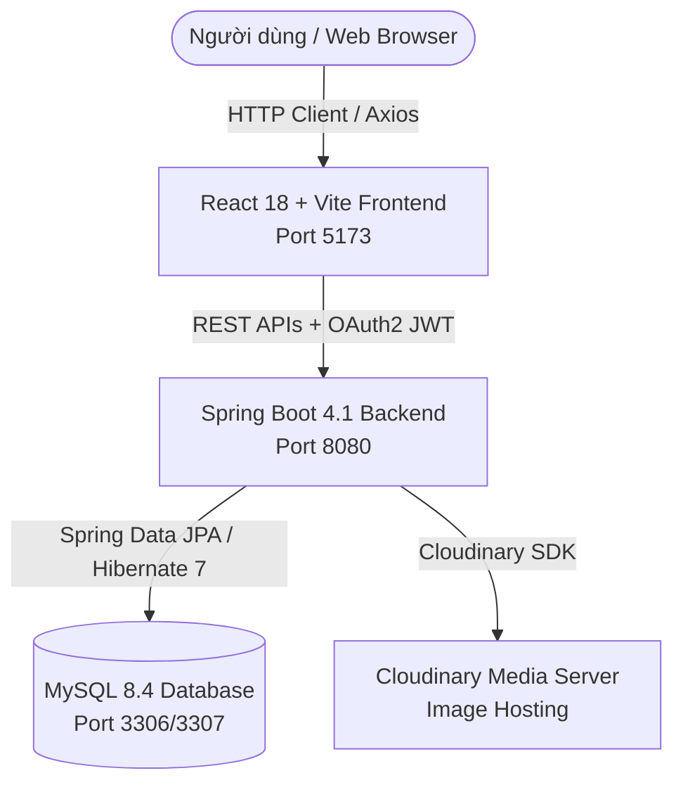

# 🍵🍰 TEA & CAKE SHOP - FULLSTACK APPLICATION
**Hệ Thống Quản Lý & Cửa Hàng Trà & Bánh Ngọt Cao Cấp (Spring Boot 4 + React 18 Vite + MySQL + TailwindCSS)**

[](https://www.oracle.com/java/)
[](https://spring.io/projects/spring-boot)
[](https://reactjs.org/)
[](https://vitejs.dev/)
[](https://tailwindcss.com/)
[](https://www.mysql.com/)
[](https://www.docker.com/)
[](http://localhost:8080/swagger-ui.html)

---

## 📖 Mục lục
1. [Giới thiệu tổng quan](#1--giới-thiệu-tổng-quan)
2. [Kiến trúc Hệ thống](#2--kiến-trúc-hệ-thống)
3. [Các tính năng nổi bật (Core Features)](#3--các-tính-năng-nổi-bật-core-features)
4. [Công nghệ & Thư viện (Tech Stack)](#4--công-nghệ--thư-viện-tech-stack)
5. [Cấu trúc Cơ sở Dữ liệu (Database Schema)](#5--cấu-trúc-cơ-sở-dữ-liệu-database-schema)
6. [Danh sách RESTful API Specifications](#6--danh-sách-restful-api-specifications)
7. [Hướng dẫn Cài đặt & Khởi chạy (Installation & Setup)](#7--hướng-dẫn-cài-đặt--khởi-chạy-installation--setup)
8. [Cấu trúc Thư mục Dự án (Folder Structure)](#8--cấu-trúc-thư-mục-dự-án-folder-structure)
9. [Biến Môi Trường (.env)](#9--biến-môi-trường-env)
10. [Tài khoản Mặc định & Thử nghiệm](#10--tài-khoản-mặc-định--thử-nghiệm)

---

## 1. 🌟 Giới thiệu tổng quan

**Tea & Cake Shop** là ứng dụng Web Fullstack hiện đại, giải pháp toàn diện cho mô hình kinh doanh **Cửa hàng Trà & Bánh ngọt cao cấp**. 

Ứng dụng kết hợp giữa nền tảng **Spring Boot RESTful Backend API** bảo mật cao với giao diện **React 18 Vite Frontend** phản hồi nhanh, được thiết kế lấy cảm hứng từ phong cách thân thiện của Duolingo với tông màu chủ đạo **Trà xanh (#4CAF82)** và **Bánh ngọt (#FF7043)**.

### 🎯 Điểm nổi bật
- 🌓 **Trải nghiệm Đa nền tảng**: Hỗ trợ đầy đủ **Chế độ Sáng / Tối (Light & Dark Mode)** và **Đa ngôn ngữ Tiếng Việt / Tiếng Anh (i18n)**.
- 🍵🍰 **Gợi ý món thông minh (Tea & Cake Pairing)**: Tự động đề xuất các loại bánh ăn kèm hoàn hảo khi khách chọn trà (và ngược lại) dựa trên độ phù hợp của hương vị.
- 🌤️ **Combo Ưu đãi theo Thời tiết**: Đề xuất các gói Combo tiết kiệm phù hợp với thời tiết hiện tại (Nắng, Mưa, Se lạnh, Nóng...).
- 🛒 **Mua sắm linh hoạt & Đặt bàn Online**: Khách vãng lai và khách đăng nhập đều có thể mua hàng Online, sử dụng Giỏ hàng (Cart Token), áp dụng Mã giảm giá, Thanh toán mô phỏng (Momo, VNPay, Chuyển khoản, COD) & Đặt bàn trước tại quán.
- 📊 **Trang Quản trị Admin Dashboard**: Thống kê doanh thu theo thời gian thực (biểu đồ Recharts), quản lý đơn hàng, danh mục, sản phẩm, gói combo, chương trình khuyến mãi, đặt bàn và phân quyền tài khoản người dùng.

---

## 2. 🏗️ Kiến trúc Hệ thống

Hệ thống được thiết kế theo kiến trúc **Client-Server (REST API)** decoupled hoàn toàn giữa Backend và Frontend:



### 🔒 Luồng Bảo mật OAuth2 Resource Server & JWT Token Revocation:
1. Người dùng đăng nhập thành công ➔ Backend phát hành cặp **Access Token (15 phút)** & **Refresh Token (30 ngày)**.
2. Với mỗi request yêu cầu xác thực ➔ Frontend gửi `Authorization: Bearer <AccessToken>` qua **Axios Interceptors**.
3. **JwtRevocationValidator** kiểm tra token có nằm trong danh sách thu hồi (`revoked_access_tokens`) hoặc hết hạn hay không.
4. Khi Access Token hết hạn ➔ Client tự động dùng Refresh Token gọi API `/api/v1/public/auth/refresh` để cấp token mới mà không gián đoạn trải nghiệm người dùng.

---

## 3. 🚀 Các tính năng nổi bật (Core Features)

### 🎨 1. Trải nghiệm Khách hàng (Client Portal)
- 🌓 **Chuyển đổi Sáng / Tối (Light/Dark Mode)**: Lưu trạng thái cài đặt vào `LocalStorage`, phản hồi tức thì với giao diện dịu mắt.
- 🌐 **Đa ngôn ngữ (i18n)**: Tự động và thủ công chuyển đổi Tiếng Việt & English qua `react-i18next`.
- 🍵 **Thực đơn Trà & Bánh**: Phân loại theo Danh mục, loại sản phẩm (`TEA`, `CAKE`), lọc theo nhiệt độ (`HOT`, `COLD`, `BOTH`), độ hot, best seller, giá cả và từ khóa tìm kiếm.
- 💡 **Gợi ý món đi kèm (Tea & Cake Pairing)**: Trong trang chi tiết sản phẩm, hệ thống tự động hiển thị danh sách món được khuyến nghị ăn kèm cùng lý do kết hợp.
- 🌤️ **Gói Combo theo Thời tiết**: Trang Combo hiển thị danh sách gói Combo tiết kiệm, phân loại theo điều kiện thời tiết (Nắng, Mưa, Se lạnh, Nóng...).
- 🛒 **Giỏ hàng Thông minh (Guest & User Cart)**: Hỗ trợ khách chưa đăng nhập mua hàng thông qua `Cart Token`. Giỏ hàng hỗ trợ lưu cả **Sản phẩm lẻ** lẫn **Gói Combo**.
- 🎟️ **Mã giảm giá (Discount System)**: Khách hàng áp dụng mã ưu đãi để được trừ tiền phần trăm hoặc số tiền cố định.
- 📅 **Đặt bàn trực tuyến (Reservation)**: Đặt bàn trước với thời gian, số lượng khách, tên khách hàng và ghi chú đặc biệt.
- 📦 **Theo dõi đơn hàng (Order Tracking)**: Tra cứu nhanh đơn hàng bằng mã đơn `orderCode` với tiến trình 5 bước: `PENDING` ➔ `CONFIRMED` ➔ `PREPARING` ➔ `COMPLETED` / `CANCELLED`.
- 👤 **Trang cá nhân (Customer Profile)**: Xem thông tin cá nhân, cập nhật tài khoản, xem lịch sử đơn hàng và lịch sử đặt bàn.

### 🛠️ 2. Trang Quản trị (Admin Portal)
- 📊 **Dashboard Thống kê**:
  - Tổng quan 4 thẻ chỉ số: Doanh thu tổng, Số đơn hàng, Số khách hàng, Số sản phẩm.
  - Biểu đồ đường Doanh thu hàng ngày (**Recharts**).
  - Top 5 sản phẩm bán chạy nhất & Danh sách sản phẩm sắp hết hàng (`stockQuantity` thấp).
- 🛍️ **Quản lý Thực đơn (Products & Categories)**: Thêm, sửa, xóa danh mục, sản phẩm, quản lý tồn kho, upload ảnh trực tiếp lên **Cloudinary**.
- 🍱 **Quản lý Gói Combo & Gợi ý**: Tạo gói Combo kết hợp nhiều món với giá ưu đãi, cấu hình bảng gợi ý món đi kèm.
- 🏷️ **Quản lý Chương trình Khuyến mãi**: Tạo voucher giảm giá theo %, số tiền cố định, thiết lập đơn hàng tối thiểu và giảm tối đa.
- 📋 **Quản lý Đơn hàng & Đặt bàn**: Cập nhật trạng thái đơn hàng, duyệt/hủy lịch đặt bàn của khách.
- 💳 **Quản lý Giao dịch Thanh toán**: Theo dõi trạng thái các giao dịch mô phỏng (Momo, VNPay, Chuyển khoản, COD).
- 👥 **Quản lý Tài khoản Người dùng**: Quản lý danh sách người dùng, thay đổi phân quyền (`ADMIN`, `CUSTOMER`, `STAFF`) và khóa/mở khóa tài khoản.

---

## 4. 🛠️ Công nghệ & Thư viện (Tech Stack)

### 🔹 Backend Stack
| Công nghệ | Phiên bản | Mục đích |
| :--- | :--- | :--- |
| **Java** | 21 (LTS) | Ngôn ngữ lập trình chính |
| **Spring Boot** | 4.1.0 / 3.4.x | Framework phát triển Backend REST API |
| **Spring Security** | Built-in | Xử lý xác thực, phân quyền & bảo mật |
| **OAuth2 Resource Server** | Built-in | Xác thực JWT Access Token & Refresh Token |
| **Spring Data JPA / Hibernate** | 7.x | ORM tương tác với Database |
| **MySQL** | 8.4 (LTS) | Hệ quản trị cơ sở dữ liệu quan hệ |
| **Cloudinary Java SDK** | 2.3.0 (`cloudinary-http5`) | Lưu trữ và xử lý hình ảnh đám mây |
| **Springdoc OpenAPI 3** | 3.0.0 | Tự động tạo tài liệu API & Swagger UI |
| **Maven** | 3.9+ | Quản lý dependencies & build project |

### 🔹 Frontend Stack
| Thư viện / Tool | Phiên bản | Mục đích |
| :--- | :--- | :--- |
| **React** | 18.2 | Thư viện UI chính |
| **TypeScript** | 5.2 | Định kiểu dữ liệu tĩnh an toàn |
| **Vite** | 5.0 | Build tool siêu nhanh & Dev server |
| **TailwindCSS** | 3.4 | Styling giao diện với CSS utilities |
| **Framer Motion** | 11.0 | Hiệu ứng chuyển động & hoạt họa |
| **Lucide React** | 0.323 | Bộ icon chuẩn hiện đại |
| **Axios** | 1.6 | Client gửi HTTP Requests với JWT Interceptors |
| **react-i18next** | 14.0 | Hỗ trợ Đa ngôn ngữ (Việt / Anh) |
| **Recharts** | 2.11 | Vẽ biểu đồ thống kê doanh thu Admin |
| **react-hot-toast** | 2.4 | Thông báo dạng Toast chuyên nghiệp |
| **React Router DOM** | 6.22 | Điều hướng và định tuyến SPA |

---

## 5. 🗄️ Cấu trúc Cơ sở Dữ liệu (Database Schema)

Hệ thống gồm 15 bảng cơ sở dữ liệu được chuẩn hóa:

```text
+-----------------------+-------------------------------------------------------------+
| Bảng (Table Name)     | Mô tả chức năng                                             |
+-----------------------+-------------------------------------------------------------+
| user_accounts         | Lưu tài khoản (ADMIN, CUSTOMER, STAFF), thông tin cá nhân   |
| categories            | Danh mục sản phẩm (Trà Matcha, Trà Trái Cây, Bánh Mousse...) |
| products              | Danh sách sản phẩm, giá, tồn kho, vị, độ hot, ảnh Cloudinary |
| combos                | Gói Combo ưu đãi, phân loại theo thời tiết (WeatherType)    |
| combo_items           | Chi tiết các sản phẩm nằm trong từng gói Combo              |
| product_suggestions   | Bảng cấu hình gợi ý món ăn kèm (source_product -> suggested)|
| carts                 | Giỏ hàng (định danh bằng Token UUID cho cả Guest & User)    |
| cart_items            | Chi tiết món lẻ hoặc Combo trong giỏ hàng                   |
| orders                | Đơn hàng (loại đơn, tổng tiền, giảm giá, trạng thái)       |
| order_items           | Chi tiết các món thuộc đơn hàng                             |
| payments              | Lịch sử giao dịch thanh toán (COD, Momo, VNPay, Bank)       |
| reservations          | Đơn đặt bàn trước (ngày, giờ, số lượng khách, trạng thái)   |
| discount_campaigns    | Các chiến dịch/mã giảm giá voucher                          |
| refresh_tokens        | Lưu trữ Refresh Token cấp cho người dùng                    |
| revoked_access_tokens | Danh sách Access Token đã bị thu hồi / đăng xuất (Blacklist)|
+-----------------------+-------------------------------------------------------------+
```

---

## 6. 🌐 Danh sách RESTful API Specifications

Tất cả API được tổ chức theo chuẩn RESTful với tiền tố `/api/v1`:

### 🔓 1. Public APIs (`/api/v1/public/...`)
- `POST /api/v1/public/auth/login` - Đăng nhập hệ thống (Trả về Access & Refresh Token)
- `POST /api/v1/public/auth/register` - Đăng ký tài khoản Khách hàng
- `POST /api/v1/public/auth/refresh` - Cấp mới Access Token bằng Refresh Token
- `POST /api/v1/public/auth/logout` - Đăng xuất & thu hồi Access Token
- `GET /api/v1/public/categories` - Danh sách danh mục sản phẩm
- `GET /api/v1/public/products` - Danh sách sản phẩm (Lọc theo danh mục, loại trà/bánh, nhiệt độ, tìm kiếm)
- `GET /api/v1/public/products/{id}` - Chi tiết sản phẩm
- `GET /api/v1/public/combos` - Danh sách gói Combo
- `GET /api/v1/public/combos/weather` - Lọc Combo theo điều kiện thời tiết
- `GET /api/v1/public/suggestions/product/{productId}` - Lấy danh sách món gợi ý đi kèm
- `POST /api/v1/public/cart` - Khởi tạo giỏ hàng mới (Trả về Cart Token)
- `GET /api/v1/public/cart/{token}` - Lấy thông tin giỏ hàng theo Token
- `POST /api/v1/public/cart/{token}/items` - Thêm món/combo vào giỏ
- `PUT /api/v1/public/cart/{token}/items/{itemId}` - Cập nhật số lượng món trong giỏ
- `DELETE /api/v1/public/cart/{token}/items/{itemId}` - Xóa món khỏi giỏ
- `POST /api/v1/public/orders` - Tạo đơn hàng mới từ giỏ hàng
- `GET /api/v1/public/orders/code/{orderCode}` - Tra cứu thông tin đơn hàng theo mã
- `POST /api/v1/public/payments/simulate` - Thực hiện giao dịch thanh toán thử nghiệm
- `POST /api/v1/public/reservations` - Đặt bàn trực tuyến
- `GET /api/v1/public/discounts/validate` - Kiểm tra tính hợp lệ của mã giảm giá

### 👤 2. Customer APIs (`/api/v1/customer/...`) *(Yêu cầu Bearer JWT)*
- `GET /api/v1/customer/account/profile` - Xem thông tin cá nhân
- `PUT /api/v1/customer/account/profile` - Cập nhật thông tin cá nhân
- `GET /api/v1/customer/account/orders` - Lịch sử đơn hàng của tôi
- `GET /api/v1/customer/account/reservations` - Lịch sử đặt bàn của tôi

### 🛡️ 3. Admin APIs (`/api/v1/admin/...`) *(Yêu cầu Role ADMIN)*
- `GET /api/v1/admin/dashboard/overview` - Tổng quan chỉ số thống kê
- `GET /api/v1/admin/dashboard/daily-revenue` - Thống kê doanh thu theo ngày
- `GET /api/v1/admin/dashboard/top-products` - Top sản phẩm bán chạy
- `GET /api/v1/admin/dashboard/low-stock` - Cảnh báo sản phẩm sắp hết hàng
- `GET/POST/PUT/DELETE /api/v1/admin/products` - CRUD Sản phẩm
- `GET/POST/PUT/DELETE /api/v1/admin/categories` - CRUD Danh mục
- `GET/POST/PUT/DELETE /api/v1/admin/combos` - CRUD Gói Combo
- `GET/POST/PUT/DELETE /api/v1/admin/discounts` - CRUD Mã giảm giá
- `GET/PUT /api/v1/admin/orders` - Quản lý & Cập nhật trạng thái đơn hàng
- `GET/PUT /api/v1/admin/reservations` - Quản lý & Cập nhật trạng thái đặt bàn
- `GET/PUT /api/v1/admin/payments` - Quản lý giao dịch thanh toán
- `POST /api/v1/admin/images/upload` - Upload hình ảnh lên Cloudinary
- `GET/PUT /api/v1/admin/users` - Quản lý danh sách & Phân quyền người dùng

---

## 7. 💻 Hướng dẫn Cài đặt & Khởi chạy (Installation & Setup)

Bạn có thể chọn 1 trong 2 cách khởi chạy dưới đây:

---

### 🚀 CÁCH 1: Khởi chạy bằng Docker & Docker Compose (Khuyên dùng - Nhanh nhất)

#### Yêu cầu:
- Đã cài đặt **Docker Desktop** (hoặc Docker Engine + Docker Compose).

#### Các bước thực hiện:
1. **Tạo file cấu hình môi trường `.env`**:
   Sao chép từ `.env.example` tại thư mục gốc:
   ```bash
   cp .env.example .env
   ```

2. **Khởi chạy hệ thống**:
   Chạy 1 lệnh duy nhất tại thư mục gốc `teacakeshop`:
   ```bash
   docker-compose up -d --build
   ```
   *(Hệ thống sẽ tự động tải MySQL 8.4, build Spring Boot Backend bằng Maven container và kích hoạt theo thứ tự).*

3. **Chạy Frontend phát triển**:
   ```bash
   cd frontend
   npm install --legacy-peer-deps
   npm run dev
   ```

4. **Truy cập ứng dụng**:
   - **Frontend App**: `http://localhost:5173`
   - **Swagger UI API**: `http://localhost:8080/swagger-ui.html`
   - **Chi tiết tham khảo**: Xem file [`DOCKER_README.md`](file:///c:/O%20E/Projects/teacakeshop/DOCKER_README.md).

---

### 🛠️ CÁCH 2: Khởi chạy Thủ công (Local Development)

#### Yêu cầu:
- **Java 21 LTS**
- **Node.js** v18+ & **npm**
- **MySQL 8.x** đang chạy tại `localhost:3306`

#### Bước 1: Khởi tạo Cơ sở dữ liệu MySQL
Mở MySQL Workbench / DBeaver hoặc Terminal MySQL và chạy lệnh:
```sql
CREATE DATABASE IF NOT EXISTS tea_cake_shop CHARACTER SET utf8mb4 COLLATE utf8mb4_unicode_ci;
```
*(Nếu muốn nạp dữ liệu mẫu ban đầu, hãy chạy script [`teacakeshop.sql`](file:///c:/O%20E/Projects/teacakeshop/teacakeshop.sql)).*

#### Bước 2: Khởi chạy Backend (Spring Boot)
 Mở Terminal tại thư mục gốc `teacakeshop`:
```powershell
# Windows PowerShell:
.\mvnw.cmd spring-boot:run

# Linux / macOS:
./mvnw spring-boot:run
```
Backend sẽ khởi chạy thành công tại: `http://localhost:8080`.

#### Bước 3: Khởi chạy Frontend (React Vite)
Mở một Terminal mới, chuyển vào thư mục `frontend`:
```bash
cd frontend

# Cài đặt dependencies
npm install --legacy-peer-deps

# Khởi chạy Vite dev server
npm run dev
```
Trình duyệt sẽ tự động mở trang web tại `http://localhost:5173`.

---

## 8. 📂 Cấu trúc Thư mục Dự án (Folder Structure)

```text
teacakeshop/
├── .env                            # Biến môi trường local/docker
├── .env.example                    # File mẫu biến môi trường
├── docker-compose.yml              # Cấu hình Docker Compose (MySQL + Backend)
├── Dockerfile                      # Multi-stage Docker build cho Spring Boot
├── DOCKER_README.md                # Hướng dẫn chi tiết đóng gói Docker
├── pom.xml                         # Dependency management của Maven
├── teacakeshop.sql                 # Script SQL khởi tạo & kiểm tra dữ liệu mẫu
├── api-test.http                   # Kịch bản test REST APIs bằng HTTP Client
│
├── frontend/                       # React 18 + TypeScript Frontend App
│   ├── public/                     # Static assets, Favicon
│   ├── src/
│   │   ├── api/                    # Modules Axios gọi API (auth, products, combos, cart...)
│   │   ├── components/             # Reusable UI components (Navbar, Footer, ProductCard...)
│   │   ├── contexts/               # React Contexts (AuthContext, CartContext, ThemeContext)
│   │   ├── hooks/                  # Custom React Hooks (useAuth, useCart, useTheme)
│   │   ├── i18n/                   # Cấu hình & từ điển đa ngôn ngữ (vi.json, en.json)
│   │   ├── pages/                  # Các trang chính của Khách hàng (Home, Products, Cart...)
│   │   │   └── admin/              # Các trang Quản trị Admin (Dashboard, AdminProducts...)
│   │   ├── styles/                 # Global CSS & Tailwind configuration
│   │   ├── types/                  # TypeScript Data Models & Interfaces
│   │   ├── App.tsx                 # Main Routing & Layout wrapper
│   │   └── main.tsx                # Frontend Entry Point
│   ├── package.json                # Dependencies & scripts frontend
│   └── vite.config.ts              # Proxy API configuration & dev server settings
│
└── src/main/                        # Spring Boot 4.1 Java Backend App
    ├── java/com/example/teacakeshop/
    │   ├── config/                 # Security, CORS, Cloudinary, OpenApi, Jackson configs
    │   ├── constant/               # Enums (Role, OrderStatus, PaymentMethod, WeatherType...)
    │   ├── controller/             # REST Controllers divided by scope
    │   │   ├── admin/              # Admin-only management endpoints
    │   │   ├── customer/           # Customer account endpoints
    │   │   └── publicapi/          # Public guest & auth endpoints
    │   ├── dto/                    # Data Transfer Objects (Requests & Responses)
    │   ├── entity/                 # JPA Database Entities
    │   ├── exception/              # Custom Exceptions & Global Exception Handler
    │   ├── repository/             # Spring Data JPA Repositories
    │   ├── security/               # Custom UserDetailsService, JWT Filters & Validators
    │   ├── service/                # Business Logic Services & Implementations
    │   └── TeacakeshopApplication.java # Spring Boot Main Class
    └── resources/
        └── application.properties  # Backend configurations & environment fallbacks
```

---

## 9. ⚙️ Biến Môi Trường (.env)

| Biến Môi Trường | Giá trị mặc định | Mô tả |
| :--- | :--- | :--- |
| `SERVER_PORT` | `8080` | Cổng dịch vụ Spring Boot Backend |
| `DB_URL` | `jdbc:mysql://localhost:3306/tea_cake_shop` | Chuỗi kết nối JDBC tới MySQL |
| `DB_USERNAME` | `root` | Tên đăng nhập cơ sở dữ liệu |
| `DB_PASSWORD` | `12345` | Mật khẩu truy cập cơ sở dữ liệu |
| `JWT_SECRET` | *(Base64 string)* | Khóa ký JWT Token (yêu cầu tối thiểu 32 bytes) |
| `JWT_EXPIRATION_SECONDS` | `900` | Thời hạn sống của Access Token (15 phút) |
| `REFRESH_TOKEN_EXPIRATION_SECONDS` | `2592000` | Thời hạn sống của Refresh Token (30 ngày) |
| `CLOUDINARY_CLOUD_NAME` | `ojojucnl` | Tên Cloudinary cloud lưu trữ hình ảnh |
| `CLOUDINARY_API_KEY` | `982788885259123` | API Key của tài khoản Cloudinary |
| `CLOUDINARY_API_SECRET` | `...` | API Secret của tài khoản Cloudinary |
| `JPA_DDL_AUTO` | `update` | Cấu hình tự động cập nhật cấu trúc DB |

---

## 10. 🔑 Tài khoản Mặc định & Thử nghiệm

Hệ thống có sẵn tính năng **AdminAccountSeeder** tự động tạo tài khoản Quản trị viên cấp cao khi hệ thống khởi chạy lần đầu:

- **Tài khoản Admin (Quản trị viên)**:
  - **Email**: `admin@teacakeshop.com`
  - **Password**: `Admin@123`
  - **Quyền hạn**: `ADMIN` (Quyền cao nhất, mở khóa toàn bộ menu Quản trị Admin Dashboard)

- **Tạo tài khoản Khách hàng thử nghiệm**:
  - Bạn có thể đăng ký tài khoản Khách hàng mới trực tiếp tại giao diện Đăng ký (`http://localhost:5173/register`).

---

🎉 **Chúc bạn có trải nghiệm tuyệt vời với Hệ Thống Tea & Cake Shop!** 🍵🍰
