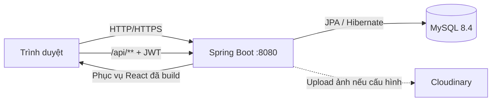

# Tea & Cake Shop

Hệ thống bán trà, bánh và combo kết hợp quản lý đơn hàng, thanh toán, tồn kho và đặt bàn Lounge. Dự án sử dụng Spring Boot làm backend, React làm frontend và MySQL làm cơ sở dữ liệu.

Ở chế độ production/Docker, frontend được build và đóng gói vào Spring Boot. Người dùng chỉ cần truy cập một địa chỉ duy nhất: `http://localhost:8080`.

[](https://openjdk.org/)
[](https://spring.io/projects/spring-boot)
[](https://react.dev/)
[](https://www.mysql.com/)

## Mục lục
1. [Tổng quan hệ thống](#1-tổng-quan-hệ-thống)
2. [Kiến trúc và công nghệ](#2-kiến-trúc-và-công-nghệ)
3. [Phân quyền và Vai trò (Roles)](#3-phân-quyền-và-vai-trò-roles)
4. [Thuật toán người dùng](#4-thuật-toán-người-dùng)
5. [Thuật toán vận hành](#5-thuật-toán-vận-hành)
6. [Hệ thống quy trình (Workflows)](#6-hệ-thống-quy-trình-workflows)
7. [Cấu trúc dự án](#7-cấu-trúc-dự-án)
8. [Hướng dẫn cài đặt và sử dụng](#8-hướng-dẫn-cài-đặt-và-sử-dụng)
9. [Giấy phép sử dụng (License)](#9-giấy-phép-sử-dụng-license)

---

## 1. Tổng quan hệ thống
Các nhóm chức năng chính:
- Đăng ký, đăng nhập, làm mới token và đăng xuất.
- Xem danh mục, sản phẩm, combo, sản phẩm nổi bật và gợi ý phối món.
- Giỏ hàng hỗ trợ cả khách vãng lai và người dùng đăng nhập.
- Ba loại đơn: giao hàng thông thường, đặt trước tự lấy và combo kết hợp đặt bàn.
- Voucher theo phần trăm, điều kiện giá trị đơn và loại đơn.
- Thanh toán mô phỏng chuyển khoản, MoMo, VNPay và COD theo điều kiện.
- Đặt bàn, kiểm tra sức chứa, theo dõi và hủy lịch hợp lệ.
- Quản lý sản phẩm, danh mục, combo, đơn, lịch đặt bàn, người dùng và voucher.
- Theo dõi thanh toán và lịch sử điều chỉnh tồn kho.
- Dashboard thống kê dành cho quản trị viên.

## 2. Kiến trúc và công nghệ



- **Backend**: Java 21, Spring Boot 4.1, Spring Security (OAuth2/JWT), Hibernate/JPA.
- **Frontend**: React 18, Vite 5, Tailwind CSS, TypeScript.
- **Database**: MySQL 8.4.

## 3. Phân quyền và Vai trò (Roles)
Hệ thống sử dụng Spring Security để bảo vệ API và phân quyền 3 cấp độ:

| Chức năng | CUSTOMER (Khách) | STAFF (Nhân viên) | ADMIN (Quản trị) |
|---|:---:|:---:|:---:|
| Xem sản phẩm, combo, đặt hàng | Có | Có | Có |
| Xem lịch sử đơn cá nhân | Có | Có | Có |
| Quản lý đơn hàng, đặt bàn khách | Không | Có | Có |
| Điều chỉnh tồn kho | Không | Có | Có |
| Xem danh sách thanh toán | Không | Có | Có |
| CRUD danh mục, sản phẩm, combo | Không | Không | Có |
| Quản lý voucher, tài khoản | Không | Không | Có |
| Xác nhận thanh toán tiền mặt (COD) | Không | Không | Có |
| Dashboard thống kê, Dừng đặt bàn | Không | Không | Có |

- **CUSTOMER**: Khách hàng, có thể đặt hàng, theo dõi đơn, hủy đặt bàn (nếu chưa xử lý).
- **STAFF**: Nhân viên vận hành, quản lý đơn hàng và lượng khách tới quán.
- **ADMIN**: Quản trị viên tối cao, nắm toàn quyền, quản lý tài khoản, báo cáo doanh thu và cấu hình hệ thống.

## 4. Thuật toán người dùng
Hệ thống tích hợp các thuật toán nhằm mang lại trải nghiệm tiện lợi cho khách hàng:

- **Thuật toán Xác thực (JWT Authentication)**:
  1. Người dùng nhập credentials.
  2. Hệ thống xác thực và cấp `Access Token` (lưu sessionStorage) & `Refresh Token` (lưu localStorage).
  3. Trình duyệt tự động đính kèm Bearer token vào các request. Khi hết hạn, tự động gọi API làm mới token.
- **Thuật toán Giỏ hàng & Tính toán tổng tiền**:
  1. Lấy danh sách sản phẩm, kiểm tra tồn kho realtime.
  2. Tính tổng giá trị dựa trên `số lượng * đơn giá`.
  3. Áp dụng Voucher (nếu có): Kiểm tra điều kiện (tối thiểu, loại đơn), trừ phần trăm chiết khấu. Tính tổng tiền thanh toán cuối cùng.
- **Thuật toán Đặt đơn (Checkout)**:
  1. Kiểm tra giỏ hàng và token hiện tại.
  2. Tính toán tiền cọc (Deposit) đối với các loại đơn `TAKEAWAY` và `RESERVATION` (Yêu cầu cọc 50%).
  3. Lọc dữ liệu thanh toán, sinh mã đơn hàng (Order Code) duy nhất.

## 5. Thuật toán vận hành
Các thuật toán phức tạp hỗ trợ nhân viên và quản trị viên vận hành hệ thống trơn tru:

- **Thuật toán Quản lý Tồn kho (Inventory Management)**:
  1. Khi đơn ở trạng thái `PENDING`: Hệ thống ghi nhận tạm thời nhưng chưa trừ tồn kho chính thức.
  2. Khi chuyển sang `CONFIRMED`/`PREPARING`: Thực hiện **giữ (hold)** số lượng. Nếu là sản phẩm Combo, hệ thống bóc tách số lượng của từng món thành phần để trừ tương ứng.
  3. Khi đơn `COMPLETED`: Tồn kho chính thức được xác nhận trừ.
  4. Nếu `CANCELLED`: Hệ thống tự động hoàn trả (rollback) lại tồn kho đã giữ.
- **Thuật toán Quản lý Sức chứa (Reservation Capacity)**:
  1. Đầu vào: Khách chọn giờ đặt bàn và số người. Sức chứa tối đa của Lounge là 40 khách/khung giờ.
  2. Xử lý: Hệ thống truy vấn tổng số khách đã xác nhận `CONFIRMED`/`SEATED` trong khoảng thời gian `(Thời gian đặt - 90 phút) -> (Thời gian đặt + 90 phút)` (Mỗi phiên ngồi mặc định 90 phút).
  3. Quyết định: Nếu `Tổng số hiện tại + Số lượng khách mới <= 40`, cho phép đặt. Nếu không, từ chối và báo "Hết bàn".
- **Thuật toán Đóng/Mở Đặt bàn Khẩn cấp**:
  ADMIN có thể kích hoạt cờ `STOP_RESERVATION` trong cơ sở dữ liệu. Ngay lập tức, thuật toán ở backend sẽ chặn mọi luồng API tạo lịch đặt bàn mới, trả về 403 Forbidden.

## 6. Hệ thống quy trình (Workflows)

### 6.1 Quy trình Mua hàng (Shopping Workflow)
1. Khách hàng truy cập danh mục sản phẩm.
2. Thêm vào giỏ hàng (Guest Cart hoặc User Cart).
3. Checkout -> Chọn 1 trong 3 loại đơn:
   - `NORMAL`: Giao hàng tận nơi (Hỗ trợ COD hoặc Chuyển khoản).
   - `TAKEAWAY_PREORDER`: Đặt trước và Tự đến lấy (Cọc 50%).
   - `RESERVATION_COMBO`: Dùng tại quán kết hợp đặt bàn (Cọc 50%).
4. Thanh toán -> Hệ thống sinh mã theo dõi.

### 6.2 Quy trình Vận hành Đơn hàng (Order Workflow)
Luồng trạng thái: `PENDING` -> `CONFIRMED` -> `PREPARING` -> `COMPLETED`
- Các trạng thái `PENDING`, `CONFIRMED`, `PREPARING` có thể chuyển sang `CANCELLED` (Hủy đơn).

### 6.3 Quy trình Đặt bàn (Reservation Workflow)
Luồng trạng thái: `PENDING` -> `CONFIRMED` -> `SEATED` (Nhận bàn) -> `COMPLETED` (Hoàn thành)
- Khách không đến sẽ chuyển thành `NO_SHOW`.
- Hủy lịch chuyển thành `CANCELLED`.

## 7. Cấu trúc dự án
```text
teacakeshop_java/
├── frontend/               # Mã nguồn React (Vite, Tailwind, TypeScript)
├── src/main/java/...       # Mã nguồn Backend Spring Boot
├── .env.example            # Mẫu cấu hình biến môi trường
├── docker-compose.yml      # Cấu hình triển khai Docker
├── Dockerfile              # Kịch bản Build multi-stage
├── pom.xml                 # Cấu hình Maven
└── README.md               # Tài liệu dự án
```

## 8. Hướng dẫn cài đặt và sử dụng

### Chạy bằng Docker (Khuyên dùng)
1. Copy file `.env.example` thành `.env` và điền các mật khẩu, secret.
2. Mở terminal và chạy lệnh:
   ```bash
   docker compose up --build -d
   ```
3. Truy cập `http://localhost:8080`. API Docs có tại `/swagger-ui.html`.

### Chạy trực tiếp qua IntelliJ IDEA & Node.js
1. Tạo Database MySQL tên `tea_cake_shop`.
2. Khai báo biến môi trường (DB_URL, DB_USERNAME, DB_PASSWORD, JWT_SECRET...) trong IDE.
3. Chạy class `TeacakeshopApplication`.
4. Bật terminal mới, trỏ vào thư mục `frontend`:
   ```bash
   npm ci
   npm run dev
   ```
5. Truy cập `http://localhost:5173`.

## 9. Giấy phép sử dụng (License)

Dự án này được phát hành dưới Giấy phép MIT (có sửa đổi). Bản quyền thuộc về **Nhóm liencse**.

> [!WARNING]
> **LƯU Ý QUAN TRỌNG:**
> Dự án và mã nguồn này **CHỈ** được phép sử dụng cho mục đích **nghiên cứu và học tập**. Nghiêm cấm mọi hành vi sử dụng hệ thống này để **kinh doanh, thương mại, hoặc thu lợi nhuận** dưới bất kỳ hình thức nào.

Modified MIT License

Copyright (c) 2026 Nhóm liencse

Permission is hereby granted, free of charge, to any person obtaining a copy
of this software and associated documentation files (the "Software"), to deal
in the Software without restriction, including without limitation the rights
to use, copy, modify, merge, publish, distribute, sublicense, and/or sell
copies of the Software, EXCEPT for commercial purposes or for-profit activities,
and to permit persons to whom the Software is furnished to do so, subject to
the following conditions:

The Software shall be used exclusively for educational and research purposes.
The above copyright notice, this permission notice, and the non-commercial 
restriction shall be included in all copies or substantial portions of the Software.

THE SOFTWARE IS PROVIDED "AS IS", WITHOUT WARRANTY OF ANY KIND, EXPRESS OR
IMPLIED, INCLUDING BUT NOT LIMITED TO THE WARRANTIES OF MERCHANTABILITY,
FITNESS FOR A PARTICULAR PURPOSE AND NONINFRINGEMENT. IN NO EVENT SHALL THE
AUTHORS OR COPYRIGHT HOLDERS BE LIABLE FOR ANY CLAIM, DAMAGES OR OTHER
LIABILITY, WHETHER IN AN ACTION OF CONTRACT, TORT OR OTHERWISE, ARISING FROM,
OUT OF OR IN CONNECTION WITH THE SOFTWARE OR THE USE OR OTHER DEALINGS IN THE
SOFTWARE.
