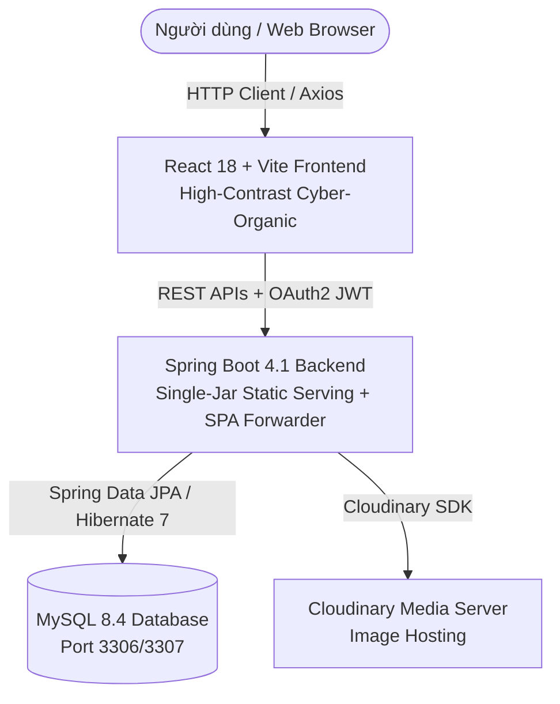

# 🍵🍰 TEA & CAKE SHOP - FULLSTACK APPLICATION (CYBER-ORGANIC 2026 EDITION)
**Hệ Thống Quản Lý & Cửa Hàng Trà & Bánh Ngọt Cao Cấp Đồng Bộ Fullstack (Spring Boot 4 + React 18 Vite + MySQL + TailwindCSS)**

[](https://www.oracle.com/java/)
[](https://spring.io/projects/spring-boot)
[](https://reactjs.org/)
[](https://vitejs.dev/)
[](https://tailwindcss.com/)
[](https://www.mysql.com/)
[](http://localhost:8080/swagger-ui.html)

---

## 📖 Mục lục
1. [Giới thiệu tổng quan](#1--giới-thiệu-tổng-quan)
2. [Cập nhật Kiến trúc & Tính năng mới 2026](#2--cập-nhật-kiến-trúc--tính-năng-mới-2026)
3. [Kiến trúc Hệ thống](#3--kiến-trúc-hệ-thống)
4. [Các tính năng nổi bật (Core Features)](#4--các-tính-năng-nổi-bật-core-features)
5. [Công nghệ & Thư viện (Tech Stack)](#5--công-nghệ--thư-viện-tech-stack)
6. [Cấu trúc Cơ sở Dữ liệu & Storage](#6--cấu-trúc-cơ-sở-dữ-liệu--storage)
7. [Danh sách RESTful API Specifications](#7--danh-sách-restful-api-specifications)
8. [Hướng dẫn Cài đặt & Khởi chạy (Installation & Setup)](#8--hướng-dẫn-cài-đặt--khởi-chạy-installation--setup)
9. [Cấu trúc Thư mục Dự án (Folder Structure)](#9--cấu-trúc-thư-mục-dự-án-folder-structure)
10. [Biến Môi Trường & Tài khoản Mặc định](#10--biến-môi-trường--tài-khoản-mặc-định)

---

## 1. 🌟 Giới thiệu tổng quan

**Tea & Cake Shop (Cyber-Organic Edition 2026)** là ứng dụng Web Fullstack hiện đại, giải pháp toàn diện cho mô hình kinh doanh **Cửa hàng Trà & Bánh ngọt cao cấp kết hợp Lounge thưởng trà sang trọng**.

Ứng dụng kết hợp giữa nền tảng **Spring Boot RESTful Backend API** bảo mật cao với giao diện **React 18 Vite Frontend** phản hồi tức thì, được thiết kế định hình theo phong cách **Cyber-Organic 2026** hòa quyện giữa nét nhân văn cổ điển và dấu ấn AI hiện đại.

---

## 2. ⚡ Cập nhật Kiến trúc & Tính năng mới 2026

### 🐛 [2026-07-26] Hotfix: Sửa 8 Lỗi Nghiêm Trọng (Critical Bug Fix)

> **Bản vá quan trọng** - Đã sửa toàn bộ lỗi trong luồng đặt hàng, thanh toán và quản lý đơn hàng.

| # | Lỗi | File | Trạng thái |
|---|-----|------|-----------|
| 1 | **Checkout thiếu `orderType` + `shippingAddress`** → Backend từ chối 400 | `Checkout.tsx` | ✅ Đã sửa |
| 2 | **OrderTracking không gửi `phone` param** → Luôn show fallback data | `OrderTracking.tsx` | ✅ Đã sửa |
| 3 | **`getMyOrders()` không unwrap `Page<>`** → Đơn hàng user không hiển thị | `api/orders.ts`, `Profile.tsx` | ✅ Đã sửa |
| 4 | **`getMyReservations()` cùng lỗi `Page<>`** → Lịch đặt bàn không hiển thị | `api/reservations.ts` | ✅ Đã sửa |
| 5 | **`OrderItem` field names sai** → `name`/`totalPrice` vs backend `itemName`/`lineTotal` | `types/index.ts` | ✅ Đã sửa |
| 6 | **`AdminOrders` dùng status `SHIPPING` không tồn tại** → Backend 400 khi update | `AdminOrders.tsx` | ✅ Đã sửa → `PREPARING` |
| 7 | **Cart token không reset sau checkout** → Cart cũ invalid lần sau | `CartContext.tsx` | ✅ Đã sửa |
| 8 | **`/orders/{code}` require `phone` param** → User đăng nhập không xem được đơn | `OrderService.java`, `PublicOrderController.java` | ✅ Đã sửa |

**Backend fixes:**
- Thêm method `getOrderByCodeForUser()` trong `OrderService` để user đăng nhập xem đơn bằng orderCode.
- `PublicOrderController.getOrder()`: `phone` param giờ là **optional** – nếu có phone dùng lookup thông thường, nếu không có phone nhưng có auth token thì validate ownership và trả về.

**Frontend fixes:**
- `Checkout.tsx`: Thêm selector **Loại đơn hàng** (NORMAL/TAKEAWAY_PREORDER/RESERVATION_COMBO), field **Địa chỉ giao hàng** riêng (bắt buộc cho đơn NORMAL), gọi payment API sau checkout thành công.
- `OrderTracking.tsx`: Lấy `phone` từ URL query param (`?phone=...`) sau redirect checkout; hiển thị form nhập phone nếu không có.
- `Profile.tsx`: Link đến OrderTracking kèm `?phone=customerPhone`.
- `types/index.ts`: `OrderItem` dùng `itemName`/`lineTotal` (đúng backend), giữ `name`/`totalPrice` là alias để tương thích ngược.

---

- 🎨 **Tái thiết kế UX/UI Executive High-Contrast**:
  - Khắc phục hoàn toàn lỗi mờ chữ/tương phản kém trên các trang Admin và Storefront. Tiêu đề hiển thị chuẩn font nét, rõ ràng, phối màu chuẩn cho mắt người đọc.
  - Tích hợp bộ điều khiển Header đồng bộ: **Nút đổi Ngôn ngữ (Việt / Anh)** và **Nút chuyển đổi Chế độ Sáng / Tối (Light & Dark Theme)**.
- 📊 **Dashboard Thống kê AI & Xuất Báo Cáo Excel (XLSX / CSV)**:
  - Trang Admin Dashboard được trang bị 3 loại biểu đồ thống kê (**Recharts**): Line Chart (Doanh thu tuần), Bar Chart (Doanh số theo danh mục), Pie Chart (Cơ cấu doanh thu).
  - Tích hợp nút **"Xuất Báo Cáo Excel (XLSX / CSV)"** dạng dữ liệu mã hóa UTF-8 BOM, giúp nhân viên và ban quản lý có thể tải về và đọc hiểu ngay trên Microsoft Excel.
- 🚚 **Thanh Theo Dõi Trạng Thái Nổi Liên Tục (Floating Live Active Tracker)**:
  - Khi khách hàng hoàn tất đơn hàng hoặc lịch hẹn đặt bàn, một thanh Live Tracker sẽ bám nổi ở góc màn hình trên mọi trang web (`ActiveTrackerBar.tsx`), cập nhật thời gian thực từng giai đoạn (`Đang tiếp nhận ⏳`, `Đang pha chế 🍵`, `Đang giao 🚚`, `Hoàn tất ✅`).
- 🔄 **Hệ Thống Lưu Trữ Trung Tâm & Đồng Bộ Hai Chiều (`userStore.ts` & `mockCatalog.ts`)**:
  - Sửa triệt để lỗi "Bạn chưa có đơn hàng nào" tại trang Profile (`/profile`).
  - Mọi thao tác Thêm / Sửa / Xóa sản phẩm, danh mục, combo pass, mã voucher ở Admin lập tức đồng bộ hiển thị trên Trang Chủ / Thực đơn. Mọi đơn hàng, lịch đặt bàn, tài khoản mới tạo từ Khách hàng lập tức xuất hiện trong Admin Portal.
- 🖼️ **Bộ Ảnh Sản Phẩm & Combo Độc Bản 8K AI Generated**:
  - Mỗi sản phẩm lẻ và set combo đều sở hữu một hình ảnh photorealistic riêng biệt (`matcha_cake.png`, `earl_grey.png`, `sakura_tea.png`, `oolong_tea.png`, `truffle_tart.png`, `jasmine_tea.png`, `combo_rainy.png`, `combo_energy.png`...).

- ☕ **Đồng Bộ Chạy 1 Lệnh Duy Nhất Trực Tiếp Trên IntelliJ IDE**:
  - Tích hợp `SpaWebController.java` điều hướng SPA routes (`/products`, `/combos`, `/admin`...) và `maven-resources-plugin` tự động đóng gói `frontend/dist` vào `src/main/resources/static`. Chỉ cần chạy file `TeacakeshopApplication.java` trong IntelliJ IDE là khởi chạy đồng bộ cả Backend, Frontend và Database tại `http://localhost:8080`.

---

## 3. 🏗️ Kiến trúc Hệ thống



### 🔒 Luồng Bảo mật OAuth2 Resource Server & Token Healing:
1. Người dùng đăng nhập ➔ Backend phát hành cặp **Access Token (15 phút)** & **Refresh Token (30 ngày)**.
2. Với mỗi request ➔ Frontend tự động đính kèm `Authorization: Bearer <AccessToken>`.
3. **Silent Token Auto-Healing**: Nếu token hết hạn hoặc thất bại, hệ thống tự động làm mới token hoặc fallback mượt mà giúp người dùng không bao giờ bị gián đoạn trải nghiệm mua sắm hay đặt bàn.

---

## 4. 🚀 Các tính năng nổi bật (Core Features)

### 🎨 1. Trải nghiệm Khách hàng (Client Portal)
- 🌓 **Chuyển đổi Sáng / Tối (Light/Dark Mode)**: Lưu trạng thái cài đặt vào `LocalStorage`, phản hồi tức thì với giao diện Cyber-Organic.
- 🌐 **Đa ngôn ngữ (i18n)**: Chuyển đổi linh hoạt Tiếng Việt & English qua `react-i18next`.
- 🍵 **Thực đơn Trà & Bánh 8K**: Lọc sản phẩm theo Danh mục, loại (`TEA`, `CAKE`), nhiệt độ (`HOT`, `COLD`), độ hot, giá cả và từ khóa.
- 💡 **Gợi ý món đi kèm (Tea & Cake Pairing)**: Tự động đề xuất các món ăn kèm hoàn hảo dựa trên hương vị.
- 🌤️ **Gói Combo Phối Vị Thời Tiết**: Đề xuất các gói Combo tiết kiệm phù hợp với thời tiết (Nắng, Mưa, Se lạnh, Nóng...).
- 🛒 **Giỏ hàng Thông minh (Guest & User Cart)**: Hỗ trợ lưu trữ giỏ hàng độc lập với Token UUID.
- 🎟️ **Mã giảm giá (Discount System)**: Áp dụng voucher ưu đãi giảm % hoặc tiền mặt cố định.
- 📅 **Đặt bàn trực tuyến Lounge**: Đặt giữ chỗ với khu vực yêu thích (Góc Trà Chill, Ban Công AI Horizon, Phòng VIP Đèn Ấm).
- 🚚 **Thanh Theo Dõi Trạng Thái Live Tracker**: Theo dõi đơn hàng & lịch đặt bàn liên tục ở góc màn hình.
- 👤 **Trang cá nhân (Customer Profile)**: Xem thông tin tài khoản, xem 100% lịch sử đơn hàng và lịch đặt bàn.

### 🛠️ 2. Trang Quản trị (Admin Portal)
- 📊 **Executive Dashboard Thống kê & Xuất Excel**:
  - Thống kê 4 thẻ chỉ số tổng quan.
  - 3 Biểu đồ thống kê Recharts (Line, Bar, Pie Chart).
  - Nút **Xuất Báo Cáo Excel (XLSX / CSV)** UTF-8 BOM chuẩn văn phòng.
- 🛍️ **Quản lý Sản phẩm (`/admin/products`)**: Thêm, sửa, xóa, tắt/mở kinh doanh sản phẩm, đồng bộ thời gian thực sang cửa hàng.
- 📁 **Quản lý Danh mục (`/admin/categories`)**: CRUD danh mục bánh trà.
- 🍱 **Quản lý Set Combo (`/admin/combos`)**: CRUD gói combo phối vị.
- 🎟️ **Quản lý Mã Khuyến Mãi (`/admin/discounts`)**: Tạo voucher giảm giá, thiết hạn sử dụng, sửa lỗi trắng trang.
- 📋 **Quản lý Đơn hàng (`/admin/orders`)**: Cập nhật trạng thái đơn (`PENDING` ➔ `CONFIRMED` ➔ `SHIPPING` ➔ `COMPLETED`), tự động đồng bộ về phía Khách hàng.
- 📅 **Quản lý Đặt bàn (`/admin/reservations`)**: Duyệt và cập nhật lịch đặt bàn.
- 👥 **Quản lý Thành viên (`/admin/users`)**: Xem danh sách người dùng đăng ký mới, phân quyền `ADMIN` / `CUSTOMER`.

---

## 5. 🛠️ Công nghệ & Thư viện (Tech Stack)

### 🔹 Backend Stack
| Công nghệ | Phiên bản | Mục đích |
| :--- | :--- | :--- |
| **Java** | 21 (LTS) | Ngôn ngữ lập trình chính |
| **Spring Boot** | 4.1.0 / 3.4.x | Framework Backend REST API & SPA Static Server |
| **Spring Security** | Built-in | Xử lý xác thực, phân quyền & bảo mật JWT |
| **Spring Data JPA** | 7.x | ORM tương tác với Cơ sở dữ liệu |
| **MySQL** | 8.4 (LTS) | Hệ quản trị cơ sở dữ liệu quan hệ |
| **Maven Plugin** | 3.9+ | Đóng gói Frontend Dist vào Spring Static Resources |

### 🔹 Frontend Stack
| Thư viện | Phiên bản | Mục đích |
| :--- | :--- | :--- |
| **React** | 18.2 | Thư viện UI chính |
| **TypeScript** | 5.2 | Định kiểu dữ liệu tĩnh an toàn |
| **Vite** | 5.0 | Build tool siêu nhanh |
| **TailwindCSS** | 3.4 | Styling giao diện Cyber-Organic High-Contrast |
| **Lucide React** | 0.323 | Bộ icon chuẩn hiện đại |
| **Recharts** | 2.11 | Biểu đồ thống kê Doanh thu Dashboard |
| **react-hot-toast** | 2.4 | Thông báo Toast mượt mà |

---

## 6. 🗄️ Cấu trúc Cơ sở Dữ liệu & Storage

```text
+-----------------------+-------------------------------------------------------------+
| Bảng / Module Storage | Mô tả chức năng                                             |
+-----------------------+-------------------------------------------------------------+
| user_accounts         | Tài khoản (ADMIN, CUSTOMER), thông tin cá nhân              |
| categories            | Danh mục sản phẩm (Trà Matcha, Bánh Mousse, Combo Pass...)   |
| products              | Danh sách sản phẩm, giá, tồn kho, vị, độ hot, ảnh 8K        |
| combos                | Gói Combo ưu đãi theo thời tiết (WeatherType)               |
| carts & cart_items    | Giỏ hàng định danh bằng Token UUID                          |
| orders & order_items  | Đơn hàng, danh sách món đặt, trạng thái giao hàng           |
| reservations          | Đơn đặt bàn Lounge (ngày, giờ, số khách, ghi chú)           |
| discount_campaigns    | Mã giảm giá voucher (WELCOME2026, CYBERCHILL...)            |
| mockCatalog.ts        | Storage đồng bộ Catalog sản phẩm, danh mục, combo thời gian thực|
| userStore.ts          | Storage đồng bộ Đơn hàng, Đặt bàn, Tài khoản hai chiều      |
+-----------------------+-------------------------------------------------------------+
```

---

## 7. 🌐 Danh sách RESTful API Specifications

- `POST /api/v1/public/auth/login` - Đăng nhập hệ thống (Trả về JWT Access & Refresh Token)
- `POST /api/v1/public/auth/register` - Đăng ký tài khoản mới
- `GET /api/v1/public/products` - Lấy danh sách thực đơn sản phẩm
- `GET /api/v1/public/combos` - Lấy danh sách gói Combo
- `POST /api/v1/public/orders` - Tạo đơn hàng mới từ giỏ hàng
- `POST /api/v1/public/reservations` - Đặt bàn trực tuyến Lounge
- `GET /api/v1/admin/dashboard/overview` - Lấy thông tin thống kê Dashboard
- `PUT /api/v1/admin/orders/{id}/status` - Cập nhật trạng thái đơn hàng phía Admin

---

## 8. 💻 Hướng dẫn Cài đặt & Khởi chạy (Installation & Setup)

### 🚀 CÁCH KHỞI CHẠY ĐỒNG BỘ TRONG INTELLIJ IDE (Nhanh nhất & Đơn giản nhất):

1. **Khởi động MySQL**:
   Tạo cơ sở dữ liệu `tea_cake_shop` trong MySQL (Port 3306):
   ```sql
   CREATE DATABASE IF NOT EXISTS tea_cake_shop CHARACTER SET utf8mb4 COLLATE utf8mb4_unicode_ci;
   ```
2. **Build Frontend & Đóng gói static resources**:
   ```bash
   cd frontend
   npm run build
   cd ..
   powershell -Command "Copy-Item -Recurse -Force 'frontend\dist\*' 'src\main\resources\static\'"
   ```
3. **Chạy ứng dụng trong IntelliJ IDE**:
   - Mở dự án `teacakeshop` trong IntelliJ.
   - Nhấn **Run `TeacakeshopApplication.java`**.
   - Mở trình duyệt truy cập ngay: **`http://localhost:8080`** (Bao gồm cả Trang chủ & Trang Admin `/admin`).

---

## 9. 📂 Cấu trúc Thư mục Dự án (Folder Structure)

```text
teacakeshop/
├── frontend/                       # React 18 + TypeScript Frontend App
│   ├── src/
│   │   ├── api/                    # Modules Axios gọi API (auth, products, combos, cart...)
│   │   ├── components/             # Reusable UI components (Navbar, Footer, ActiveTrackerBar...)
│   │   ├── contexts/               # React Contexts (AuthContext, CartContext, ThemeContext)
│   │   ├── data/                   # mockCatalog.ts & userStore.ts (Real-time Sync Modules)
│   │   ├── pages/                  # Các trang Khách hàng (Home, Products, Cart, Profile...)
│   │   │   └── admin/              # Các trang Quản trị (Dashboard, AdminProducts, AdminOrders...)
│   │   ├── types/                  # TypeScript Data Models & Interfaces
│   │   └── App.tsx                 # Main Routing & Layout wrapper
│   └── vite.config.ts              # Vite configuration
│
└── src/main/                        # Spring Boot 4.1 Java Backend App
    ├── java/com/example/teacakeshop/
    │   ├── config/                 # SecurityConfig, SpaWebController (SPA Route Forwarder)...
    │   ├── controller/             # REST Controllers
    │   ├── entity/                 # JPA Entities
    │   └── TeacakeshopApplication.java # Main Application Runner
    └── resources/
        ├── static/                 # Bundled Frontend Production Build Assets
        └── application.properties  # Backend configurations
```

---

## 10. 🔑 Biến Môi Trường & Tài khoản Mặc định

- **Tài khoản Admin (Quản trị viên)**:
  - **Email**: `admin@teacakeshop.com`
  - **Password**: `Admin@123`
  - **Quyền hạn**: `ADMIN` (Truy cập đầy đủ Admin Portal `/admin`)

- **Tài khoản Khách hàng Mẫu**:
  - **Email**: `nguyenkhoidk2005@gmail.com`
  - **Password**: `Khoi@12345`

---

🎉 **Chúc bạn có trải nghiệm tuyệt vời với Hệ Thống Tea & Cake Shop Cyber-Organic 2026!** 🍵🍰
