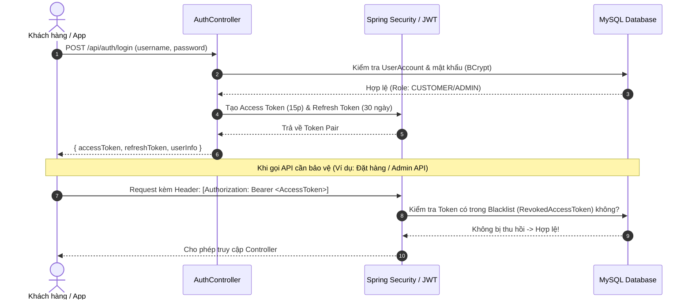
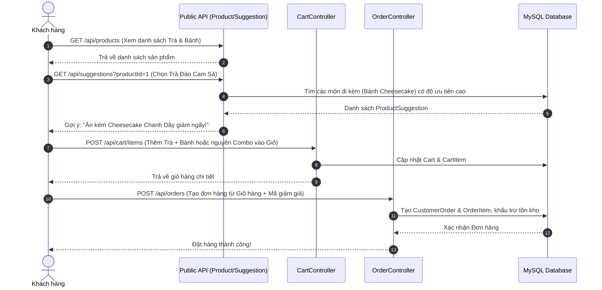
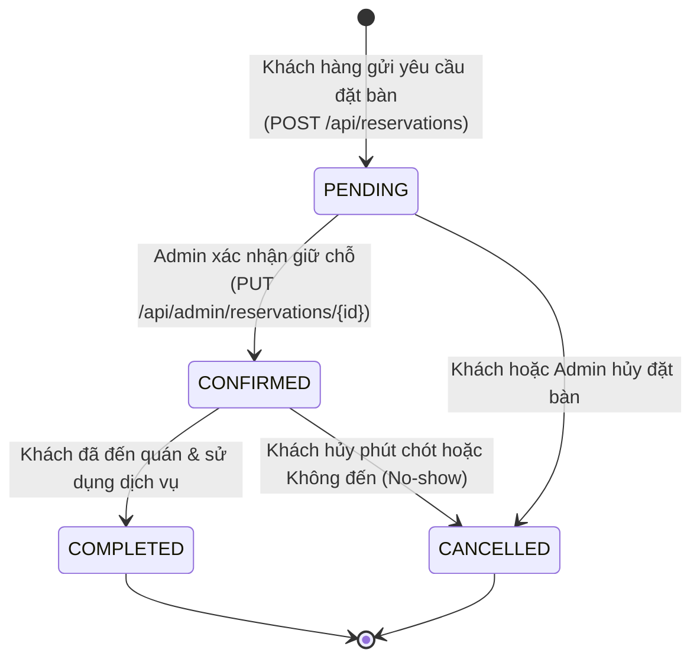

# 🍵🍰 TEA & CAKE SHOP BACKEND API
**Hệ Thống Quản Lý Cửa Hàng Trà & Bánh Ngọt Cao Cấp (Spring Boot 3 + Java 21 + MySQL + Docker)**

[](https://www.oracle.com/java/)
[](https://spring.io/projects/spring-boot)
[](https://www.mysql.com/)
[](https://www.docker.com/)
[](https://cloudinary.com/)
[](http://localhost:8080/swagger-ui.html)

---

## 📖 Mục lục
1. [Giới thiệu & Mục đích dự án](#1--giới-thiệu--mục-đích-dự-án)
2. [Các tính năng nổi bật (Core Features)](#2--các-tính-năng-nổi-bật-core-features)
3. [Công nghệ sử dụng (Tech Stack)](#3--công-nghệ-sử-dụng-tech-stack)
4. [Luồng hoạt động của Hệ thống (System Workflows)](#4--luồng-hoạt-động-của-hệ-thống-system-workflows)
5. [Mô hình Dữ liệu & Các Thực thể chính (Database Architecture)](#5--mô-hình-dữ-liệu--các-thực-thể-chính-database-architecture)
6. [Hướng dẫn Cài đặt & Khởi chạy (Installation & Usage)](#6--hướng-dẫn-cài-đặt--khởi-chạy-installation--usage)
7. [Tài liệu API & Cách Kiểm thử (API Testing)](#7--tài-liệu-api--cách-kiểm-thử-api-testing)
8. [Cấu trúc Thư mục Mã nguồn (Folder Structure)](#8--cấu-trúc-thư-mục-mã-nguồn-folder-structure)

---

## 1. 🌟 Giới thiệu & Mục đích dự án

**Tea & Cake Shop Backend** là giải pháp phần mềm máy chủ (Backend API) toàn diện được thiết kế chuyên biệt cho mô hình **Tiệm Trà & Bánh Ngọt (Tea & Cake Shop)** hiện đại.

### 🎯 Mục đích phục vụ
- **Tối ưu hóa quản lý kinh doanh**: Giúp chủ cửa hàng (Admin) dễ dàng quản lý toàn bộ thực đơn trà, bánh, phân loại danh mục, tồn kho, giá cả và hình ảnh sản phẩm.
- **Trải nghiệm mua sắm thông minh (Smart Cross-selling)**: Thay vì chỉ bán các món lẻ, hệ thống tích hợp **cơ chế gợi ý kết hợp trà và bánh lý tưởng (Tea & Cake Pairing suggestions)** và các **Gói Combo ưu đãi tiết kiệm**, giúp tăng giá trị đơn hàng trung bình và mang đến trải nghiệm ẩm thực hoàn hảo cho khách hàng.
- **Đa dạng hóa dịch vụ**: Đồng bộ trọn gói luồng **Mua hàng online/Giao tận nơi (E-commerce Order)** và luồng **Đặt bàn trước tại quán (Table Reservation)**.
- **Bảo mật chuẩn doanh nghiệp**: Đảm bảo an toàn dữ liệu khách hàng và quyền quản trị nội bộ nhờ hệ thống bảo mật hai lớp **OAuth2 / JWT Access Token & Refresh Token** đi kèm cơ chế thu hồi (Blacklisting) token khi đăng xuất.

---

## 2. 🚀 Các tính năng nổi bật (Core Features)

### 🔐 1. Bảo mật & Phân quyền (Security & Authentication)
- **Đăng ký / Đăng nhập an toàn**: Hỗ trợ xác thực người dùng dựa trên chuẩn **OAuth2 Resource Server** + **JWT (JSON Web Token)**.
- **Quản lý Token thông minh**: Cấp phát đồng thời `AccessToken` (thời hạn ngắn, 15 phút) và `RefreshToken` (thời hạn dài, 30 ngày).
- **Thu hồi Token (Token Blacklisting)**: Khi người dùng đăng xuất, Access Token và Refresh Token lập tức bị khóa trong bảng `revoked_access_tokens`, ngăn chặn triệt để việc tái sử dụng token trái phép.
- **Phân quyền Role-based (RBAC)**: Phân rõ 2 vai trò:
  - `ROLE_ADMIN`: Toàn quyền quản lý dashboard, danh mục, sản phẩm, combo, gợi ý, đơn hàng và người dùng.
  - `ROLE_CUSTOMER`: Quyền khách hàng (mua sắm, quản lý giỏ hàng cá nhân, xem lịch sử đơn hàng, đặt bàn).

### 🍵🍰 2. Quản lý Sản phẩm & Danh mục đa dạng
- Phân loại rõ ràng theo `productType` (`TEA` - Trà hoặc `CAKE` - Bánh).
- Ghi nhận chi tiết thông tin chuyên sâu cho ẩm thực: Hương vị (`taste`), Nhiệt độ phục vụ (`temperatureType`: Nóng/Lạnh), Phù hợp theo mùa (`season`), Số lượng tồn kho (`stockQuantity`).
- Tích hợp **Cloudinary** cho phép Admin tải lên (`upload`) và quản lý hình ảnh sản phẩm chất lượng cao trực tiếp từ API.

### 💡 3. Hệ thống Gợi ý Món & Combo Tiết kiệm (Pairing & Bundles)
- **Gợi ý món ăn ý (`ProductSuggestion`)**: Hệ thống tự động đề xuất món đi kèm (Ví dụ: Khách chọn *Trà đào cam sả*, API sẽ gợi ý ăn kèm *Cheesecake chanh dây*), hiển thị rõ ràng **lý do kết hợp (`reason`)** và **độ ưu tiên (`priority`)**.
- **Gói Combo Ưu đãi (`Combo` & `ComboItem`)**: Admin có thể tạo các combo gồm nhiều món trà + bánh với mức giá `combo_price` ưu đãi, tự động tính toán số tiền tiết kiệm (`saving_amount = original_price - combo_price`).

### 🛒 4. Giỏ hàng & Đặt hàng (Cart & Checkout)
- **Giỏ hàng linh hoạt (`Cart` & `CartItem`)**: Hỗ trợ giỏ hàng theo định danh `token` (cho khách vãng lai) hoặc gắn kết định danh với `userAccount`. Khách có thể thêm sản phẩm lẻ hoặc nguyên gói Combo vào giỏ.
- **Quản lý Đơn hàng (`CustomerOrder` & `OrderItem`)**: Theo dõi đầy đủ trạng thái đơn hàng từ lúc đặt, xử lý đến khi hoàn thành.
- **Chiến dịch khuyến mãi (`DiscountCampaign`)**: Áp dụng mã giảm giá và chương trình khuyến mãi tự động vào đơn hàng.

### 🪑 5. Đặt bàn Trực tuyến tại Quán (Table Reservations)
- Khách hàng có thể đặt bàn trước, chọn ngày giờ, số lượng người (`partySize`) và ghi chú đặc biệt.
- Admin dễ dàng duyệt, xác nhận hoặc hủy lịch đặt bàn từ trang quản trị (`AdminReservationController`).

### 📊 6. Thống kê & Báo cáo Quản trị (Admin Dashboard)
- Cung cấp số liệu tổng quan về doanh thu, số lượng đơn hàng, món ăn bán chạy (best-sellers) phục vụ việc định hướng kinh doanh (`AdminDashboardController`).

---

## 3. 🛠️ Công nghệ sử dụng (Tech Stack)

| Lớp (Layer) | Công nghệ / Thư viện | Vai trò & Mục đích |
| :--- | :--- | :--- |
| **Ngôn ngữ chính** | **Java 21 (LTS)** | Tận dụng các tính năng hiện đại (Pattern Matching, Records, Virtual Threads ready). |
| **Core Framework** | **Spring Boot 3.4.x / 4.1.0** | Khung nền tảng xây dựng RESTful API mạnh mẽ, chuẩn kiến trúc Enterprise. |
| **Bảo mật** | **Spring Security + OAuth2** | Resource Server xác thực và cấp phát JWT, phân quyền endpoints. |
| **Cơ sở dữ liệu** | **MySQL 8.4** | Hệ quản trị cơ sở dữ liệu quan hệ (RDBMS) mạnh mẽ, lưu trữ giao dịch an toàn. |
| **ORM / JPA** | **Spring Data JPA + Hibernate** | Ánh xạ thực thể (ORM), tự động hóa truy vấn và quản lý transaction. |
| **Lưu trữ hình ảnh** | **Cloudinary SDK (`cloudinary-http5`)** | Upload và lưu trữ hình ảnh sản phẩm trên cloud, tối ưu hóa băng thông. |
| **Tài liệu API** | **Springdoc OpenAPI 3 (Swagger UI)** | Tự động tạo giao diện tài liệu API trực quan và công cụ test trực tiếp. |
| **Khởi tạo & Build** | **Maven** + **Spring Boot DevTools** | Quản lý phụ thuộc (dependencies) và hỗ trợ Hot-reload khi phát triển. |
| **Đóng gói & Deploy**| **Docker & Docker Compose** | Container hóa ứng dụng với Multi-Stage Build, đảm bảo chạy ổn định trên mọi môi trường. |

---

## 4. 🔄 Luồng hoạt động của Hệ thống (System Workflows)

### 1️⃣ Luồng Xác thực & Phân quyền (Authentication Flow)


### 2️⃣ Luồng Mua sắm, Gợi ý Món & Đặt hàng (Cross-selling & Order Flow)


### 3️⃣ Luồng Đặt bàn Trực tuyến (Reservation Flow)


---

## 5. 🗄️ Mô hình Dữ liệu & Các Thực thể chính (Database Architecture)

Hệ thống cơ sở dữ liệu `tea_cake_shop` được thiết kế tối chuẩn hóa với các bảng (Entities) cốt lõi:

- **`user_accounts` & `refresh_tokens` & `revoked_access_tokens`**: Quản lý tài khoản người dùng, vai trò (`role`), và vòng đời bảo mật của JWT.
- **`categories` & `products`**: Danh mục (Trà trái cây, Trà sữa, Bánh ngọt...) và sản phẩm chi tiết.
- **`combos` & `combo_items`**: Quản lý các set combo ưu đãi, liên kết N-N giữa Combo và Sản phẩm.
- **`product_suggestions`**: Lưu trữ luật gợi ý món ăn kèm (Sản phẩm nguồn `source_product` -> Sản phẩm được gợi ý `suggested_product`).
- **`carts` & `cart_items`**: Giỏ hàng tạm thời hoặc cố định của người dùng, chứa các sản phẩm lẻ và combo.
- **`orders` & `order_items`**: Đơn đặt hàng chính thức của khách hàng.
- **`discount_campaigns`**: Chương trình khuyến mãi, giảm giá áp dụng cho đơn hàng.
- **`payments`**: Ghi nhận phương thức và trạng thái thanh toán.
- **`reservations`**: Lịch đặt bàn tại quán (Ngày giờ, số người, trạng thái).

---

## 6. 💻 Hướng dẫn Cài đặt & Khởi chạy (Installation & Usage)

Bạn có thể chạy dự án bằng **Docker (Khuyến nghị - Nhanh chóng nhất)** hoặc chạy **Trực tiếp với Java & Maven**.

### 🔹 Cách 1: Khởi chạy bằng Docker & Docker Compose (Khuyến nghị)
> 💡 *Xem chi tiết đầy đủ tại tài liệu riêng:* **[DOCKER_README.md](DOCKER_README.md)**

1. **Chuẩn bị file cấu hình `.env`**:
   Sao chép file mẫu `.env.example` thành `.env` tại thư mục gốc của dự án (`teacakeshop`):
   ```bash
   cp .env.example .env
   ```
2. **Khởi chạy bằng 1 câu lệnh**:
   ```bash
   docker-compose up -d --build
   ```
3. Hệ thống sẽ tự động khởi tạo MySQL container (`port 3307`), chờ DB sẵn sàng, sau đó build và chạy Spring Boot backend (`port 8080`).

---

### 🔹 Cách 2: Khởi chạy thủ công (Local Development)

**Yêu cầu môi trường local:**
- **JDK 21** (Eclipse Temurin hoặc Oracle JDK).
- **MySQL 8.x** đang chạy trên máy ở cổng `3306`.
- **Maven 3.9+** (Hoặc dùng `mvnw` đi kèm trong thư mục).

**Bước 1: Cấu hình Cơ sở dữ liệu MySQL local**
Tạo database trống trong MySQL của bạn:
```sql
CREATE DATABASE tea_cake_shop CHARACTER SET utf8mb4 COLLATE utf8mb4_unicode_ci;
```

**Bước 2: Cấu hình `application.properties` hoặc biến môi trường**
Bạn có thể cập nhật trực tiếp thông tin trong file `src/main/resources/application.properties` hoặc set biến môi trường tương ứng:
```properties
DB_URL=jdbc:mysql://localhost:3306/tea_cake_shop?createDatabaseIfNotExist=true&useSSL=false&allowPublicKeyRetrieval=true&serverTimezone=Asia/Ho_Chi_Minh
DB_USERNAME=root
DB_PASSWORD=mật_khẩu_mysql_của_bạn
```

**Bước 3: Tải dependencies và chạy ứng dụng**
Sử dụng Maven Wrapper có sẵn trong dự án:
```bash
# Trên Windows PowerShell / CMD:
.\mvnw.cmd clean spring-boot:run

# Trên Linux / macOS:
./mvnw clean spring-boot:run
```

---

## 7. 🧪 Tài liệu API & Cách Kiểm thử (API Testing)

Khi ứng dụng đã khởi chạy thành công (trên cổng `8080`), bạn có hai cách tiện lợi để khám phá và kiểm thử API:

### 1. Trải nghiệm trực quan qua Swagger UI (OpenAPI 3)
Mở trình duyệt và truy cập:
👉 **[http://localhost:8080/swagger-ui.html](http://localhost:8080/swagger-ui.html)**
- Giao diện Swagger liệt kê toàn bộ các endpoints được chia theo nhóm: `Public API`, `Auth API`, `Customer API`, `Admin API`.
- Bạn có thể nhấn **Try it out** để test trực tiếp trên trình duyệt.

### 2. Kiểm thử tự động với file `api-test.http`
Dự án đi kèm một file kiểm thử toàn diện **[`api-test.http`](api-test.http)** ngay tại thư mục gốc.
- Nếu bạn sử dụng **IntelliJ IDEA Ultimate** hoặc **VS Code (với extension REST Client)**, bạn chỉ cần mở file `api-test.http` lên.
- Nhấn nút **Run / Send Request** bên cạnh từng request (như Tạo danh mục, Thêm trà/bánh, Đăng ký, Đăng nhập, Gửi đơn hàng...).

---

## 8. 📂 Cấu trúc Thư mục Mã nguồn (Folder Structure)

```text
teacakeshop/
├── .mvn/                     # Cấu hình Maven Wrapper
├── src/
│   ├── main/
│   │   ├── java/com/example/teacakeshop/
│   │   │   ├── config/       # Cấu hình Spring Security, Cloudinary, OpenAPI, Cors...
│   │   │   ├── constant/     # Các hằng số (Role, Status, Enums...)
│   │   │   ├── controller/   # REST Controllers
│   │   │   │   ├── admin/    # APIs dành riêng cho Admin (Quản lý sản phẩm, combo, đơn hàng...)
│   │   │   │   ├── customer/ # APIs dành riêng cho Khách hàng đã đăng nhập
│   │   │   │   └── publicapi/# APIs công khai (Xem menu, đăng nhập, đăng ký...)
│   │   │   ├── dto/          # Data Transfer Objects (Request / Response DTOs)
│   │   │   ├── entity/       # Thực thể JPA mapping với MySQL table
│   │   │   ├── exception/    # Global Exception Handler (Xử lý lỗi chuẩn hóa JSON)
│   │   │   ├── repository/   # JPA Repositories truy xuất cơ sở dữ liệu
│   │   │   ├── security/     # Bộ lọc JWT, Custom UserDetails, Token Provider
│   │   │   └── service/      # Business Logic Layer (Xử lý nghiệp vụ chính)
│   │   └── resources/
│   │       └── application.properties # Cấu hình Spring Boot chính
├── .dockerignore             # Danh sách bỏ qua khi build Docker
├── .env.example              # File mẫu cấu hình biến môi trường
├── .gitignore                # Danh sách bỏ qua của Git
├── Dockerfile                # Cấu hình Multi-Stage build cho Docker
├── DOCKER_README.md          # Hướng dẫn chi tiết sử dụng và triển khai Docker
├── README.md                 # Tài liệu tổng quan dự án (File này)
├── api-test.http             # Bộ kịch bản kiểm thử HTTP API trọn gói
├── docker-compose.yml        # Cấu hình orchestration cho MySQL + Backend
├── pom.xml                   # File quản lý thư viện Maven
└── teacakeshop.sql           # File script SQL tham khảo/khởi tạo mẫu
```

---

## 👨‍💻 Tác giả & Đóng góp
Dự án được phát triển và tối ưu với tinh thần chuẩn sạch, kiến trúc chuyên nghiệp phục vụ đồ án kỹ thuật cao và sẵn sàng cho môi trường thực tế.
Mọi ý kiến đóng góp hoặc câu hỏi vui lòng liên hệ qua repository Git hoặc mở Issue trên GitHub! 🎉🍵🍰
