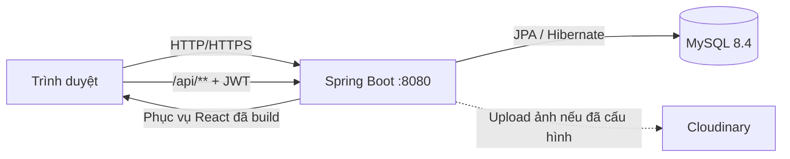

# Tea & Cake Shop

Hệ thống bán trà, bánh và combo kết hợp quản lý đơn hàng, thanh toán, tồn kho
và đặt bàn Lounge. Dự án sử dụng Spring Boot làm backend, React làm frontend
và MySQL làm cơ sở dữ liệu.

Ở chế độ production/Docker, frontend được build và đóng gói vào Spring Boot.
Người dùng chỉ cần truy cập một địa chỉ duy nhất:

```text
http://localhost:8080
```

[](https://openjdk.org/)
[](https://spring.io/projects/spring-boot)
[](https://react.dev/)
[](https://www.mysql.com/)

## Mục lục

1. [Tổng quan hệ thống](#1-tổng-quan-hệ-thống)
2. [Kiến trúc và công nghệ](#2-kiến-trúc-và-công-nghệ)
3. [Nghiệp vụ và quyền hạn của ba vai trò](#3-nghiệp-vụ-và-quyền-hạn-của-ba-vai-trò)
4. [Cách hệ thống hoạt động](#4-cách-hệ-thống-hoạt-động)
5. [Cấu trúc dự án](#5-cấu-trúc-dự-án)
6. [Biến môi trường](#6-biến-môi-trường)
7. [Cách sử dụng hệ thống](#7-cách-sử-dụng-hệ-thống)
8. [Chạy bằng Docker](#8-chạy-bằng-docker)
9. [Chạy trực tiếp bằng IntelliJ IDEA](#9-chạy-trực-tiếp-bằng-intellij-idea)
10. [Đưa hệ thống lên GitHub Codespaces](#10-đưa-hệ-thống-lên-github-codespaces)
11. [API và Swagger](#11-api-và-swagger)
12. [Kiểm thử](#12-kiểm-thử)
13. [Kiểm tra trước khi đưa lên Git](#13-kiểm-tra-trước-khi-đưa-lên-git)
14. [Lưu ý bảo mật và triển khai](#14-lưu-ý-bảo-mật-và-triển-khai)

## 1. Tổng quan hệ thống

Các nhóm chức năng chính:

- Đăng ký, đăng nhập, làm mới token và đăng xuất.
- Xem danh mục, sản phẩm, combo, sản phẩm nổi bật và gợi ý phối món.
- Giỏ hàng hỗ trợ cả khách vãng lai và người dùng đăng nhập.
- Ba loại đơn: giao hàng thông thường, đặt trước tự lấy và combo kết hợp đặt bàn.
- Voucher theo phần trăm, điều kiện giá trị đơn và loại đơn.
- Thanh toán mô phỏng chuyển khoản, MoMo, VNPay và COD theo điều kiện.
- Đặt bàn, kiểm tra sức chứa, theo dõi và hủy lịch hợp lệ.
- Quản lý sản phẩm, danh mục, combo, đơn, lịch đặt bàn, người dùng và voucher.
- Theo dõi thanh toán và lịch sử điều chỉnh tồn kho.
- Dashboard thống kê dành cho quản trị viên.
- Giao diện sáng/tối, responsive và hỗ trợ tiếng Việt/tiếng Anh.

Hệ thống có dữ liệu mẫu cho catalog và năm voucher:

| Mã | Mức giảm | Điều kiện chính |
|---|---:|---|
| `WELCOME10` | 10% | Mọi loại đơn từ 100.000₫ |
| `SAVE15` | 15% | Mọi loại đơn từ 200.000₫ |
| `PICKUP20` | 20% | Đơn tự lấy từ 350.000₫ |
| `TABLE25` | 25% | Combo đặt bàn từ 500.000₫ |
| `VIP30` | 30% | Combo đặt bàn từ 800.000₫ |

Catalog và voucher được seed theo mã/tên chưa tồn tại, vì vậy việc khởi động lại
không tạo thêm bản ghi trùng.

## 2. Kiến trúc và công nghệ



### Backend

- Java 21.
- Spring Boot 4.1.
- Spring Security OAuth2 Resource Server và JWT.
- Spring Data JPA/Hibernate.
- Bean Validation.
- MySQL 8.4.
- Springdoc OpenAPI/Swagger UI.
- Cloudinary SDK cho chức năng upload ảnh.

### Frontend

- React 18 và TypeScript.
- Vite 5.
- Tailwind CSS.
- Axios.
- React Router.
- Recharts.
- react-i18next.
- react-hot-toast.

### Mô hình chạy

- Phát triển frontend riêng: Vite chạy port `5173`, proxy `/api` tới backend
  port `8080`.
- Production, Docker và Codespaces: Vite được build thành static files, Spring
  Boot phục vụ cả frontend và API trên port `8080`.
- MySQL dùng port `3306` trong máy local. Trong Docker, MySQL chỉ nằm trong
  Docker network và không được công khai ra ngoài.

## 3. Nghiệp vụ và quyền hạn của ba vai trò

Phân quyền được kiểm tra ở cả giao diện và backend. Việc ẩn nút ở frontend không
thay thế kiểm tra quyền của Spring Security.

| Chức năng | CUSTOMER | STAFF | ADMIN |
|---|:---:|:---:|:---:|
| Xem sản phẩm, combo và voucher | Có | Có | Có |
| Tạo giỏ hàng, đặt hàng, thanh toán | Có | Có thể dùng giao diện khách | Có thể dùng giao diện khách |
| Đặt bàn và xem lịch sử cá nhân | Có | Có thể dùng giao diện khách | Có thể dùng giao diện khách |
| Xem danh sách sản phẩm, combo trong portal | Không | Chỉ đọc | Toàn quyền |
| CRUD danh mục, sản phẩm, combo và ảnh | Không | Không | Có |
| Vận hành trạng thái đơn hàng | Không | Có | Có |
| Vận hành trạng thái đặt bàn | Không | Có | Có |
| Điều chỉnh tồn kho, xem lịch sử điều chỉnh | Không | Có | Có |
| Xem danh sách thanh toán | Không | Có | Có |
| Xác nhận giao dịch tiền mặt đã thanh toán | Không | Không | Có |
| Quản lý voucher | Không | Không | Có |
| Quản lý người dùng và vai trò | Không | Không | Có |
| Dashboard quản trị | Không | Không | Có |
| Dừng/mở nhận đặt bàn toàn hệ thống | Không | Không | Có |

### 3.1 CUSTOMER — Khách hàng

Quyền và quyền lợi:

- Đăng ký tài khoản hoặc mua hàng bằng giỏ hàng khách.
- Xem chi tiết sản phẩm/combo và các gợi ý phối món.
- Áp dụng voucher trước khi checkout.
- Chọn giao hàng thông thường, đặt trước tự lấy hoặc combo kết hợp đặt bàn.
- Theo dõi đơn bằng mã đơn và thông tin xác thực tương ứng.
- Kiểm tra lịch trống, gửi yêu cầu đặt bàn và theo dõi mã đặt bàn.
- Người dùng đăng nhập có trang cá nhân để xem lịch sử đơn và lịch đặt bàn.
- Có thể tự hủy lịch đặt bàn khi lịch vẫn ở trạng thái `PENDING` và không vướng
  quy trình hoàn tiền cọc.

### 3.2 STAFF — Nhân viên vận hành

Quyền và trách nhiệm:

- Truy cập portal tại `/admin`.
- Xem catalog để phục vụ vận hành nhưng không được thêm, sửa hoặc xóa.
- Lọc, xem chi tiết và cập nhật trạng thái đơn theo luồng hợp lệ.
- Lọc, xem chi tiết và cập nhật trạng thái lịch đặt bàn.
- Điều chỉnh tồn kho; mọi thay đổi lưu số lượng trước/sau, lý do và người thực hiện.
- Xem danh sách thanh toán nhưng không được tự xác nhận giao dịch đã thu tiền.
- Không được quản lý tài khoản, voucher, dashboard quản trị hoặc đóng chức năng
  đặt bàn.

### 3.3 ADMIN — Quản trị viên

Quyền và trách nhiệm:

- Có toàn bộ quyền vận hành của STAFF.
- Xem dashboard doanh thu, đơn hàng, lịch đặt bàn, sản phẩm bán chạy và tồn kho thấp.
- CRUD danh mục, sản phẩm, combo và upload ảnh.
- CRUD voucher/chiến dịch giảm giá.
- Xem người dùng, đổi vai trò và khóa/mở tài khoản.
- Xác nhận giao dịch tiền mặt đã thanh toán.
- Dừng nhận đặt bàn khi hết bàn trong giờ cao điểm và mở lại khi sẵn sàng.

Khi ADMIN chọn **Dừng đặt bàn**, trạng thái được lưu trong MySQL. Backend từ chối
mọi yêu cầu đặt bàn mới, kể cả khi khách gọi API trực tiếp. Khách nhận được lời
xin lỗi và đề nghị đặt lại vào ngày hôm sau. Nút điều khiển này không xuất hiện
với STAFF, đồng thời API cũng trả `403 Forbidden` nếu STAFF cố gọi trực tiếp.

## 4. Cách hệ thống hoạt động

### 4.1 Xác thực

1. Người dùng đăng nhập tại `/login`.
2. Backend cấp access token và refresh token.
3. Access token có thời hạn mặc định 15 phút và được lưu trong `sessionStorage`.
4. Refresh token có thời hạn mặc định 30 ngày và được lưu trong `localStorage`.
5. Axios tự gửi `Authorization: Bearer <token>`.
6. Khi access token hết hạn, frontend gọi `/api/auth/refresh` rồi gửi lại request.
7. Backend kiểm tra vai trò ở từng nhóm API.

ADMIN và STAFF được tạo/cập nhật từ biến môi trường mỗi khi backend khởi động.
CUSTOMER tự đăng ký trên giao diện.

### 4.2 Giỏ hàng và đặt hàng

1. Backend tạo giỏ hàng và trả một cart token.
2. Mỗi lần thêm/cập nhật món, backend kiểm tra sản phẩm đang hoạt động và đủ tồn kho.
3. Với combo, tồn kho khả dụng phụ thuộc vào tồn kho của từng sản phẩm thành phần.
4. Checkout kiểm tra lại giá, giảm giá và tồn kho để tránh dữ liệu cũ từ frontend.
5. Đơn được tạo ở trạng thái `PENDING`.

Ba loại đơn:

- `NORMAL`: đơn giao hàng thông thường, yêu cầu địa chỉ giao hàng; có thể dùng COD.
- `TAKEAWAY_PREORDER`: đặt trước và tự lấy, yêu cầu thời gian nhận; cọc 50%.
- `RESERVATION_COMBO`: combo dùng cùng lịch đặt bàn, yêu cầu thời gian; cọc 50%,
  sau thanh toán chuyển tới bước hoàn tất đặt bàn.

Luồng trạng thái đơn:

```text
PENDING → CONFIRMED → PREPARING → COMPLETED
```

`PENDING`, `CONFIRMED` và `PREPARING` có thể chuyển sang `CANCELLED` nếu thỏa
điều kiện nghiệp vụ. `COMPLETED` và `CANCELLED` là trạng thái kết thúc.

### 4.3 Thanh toán

- `BANK_TRANSFER`, `MOMO_SIMULATION`, `VNPAY_SIMULATION`: thanh toán mô phỏng.
- `CASH_ON_DELIVERY`: chỉ dùng cho đơn `NORMAL`.
- Đơn đặt trước và combo đặt bàn yêu cầu cọc 50% theo giá trị sau voucher.
- Chỉ ADMIN được đánh dấu một giao dịch COD là đã thu tiền.

Đây là mô phỏng phục vụ học tập/demo, chưa phải tích hợp cổng thanh toán thật.

### 4.4 Đặt bàn

Quy tắc hiện tại:

- Sức chứa cửa hàng: 40 khách trong cùng khung thời gian.
- Thời lượng giữ bàn dùng để tính chồng lịch: 90 phút.
- Phải đặt trước ít nhất 2 giờ và tối đa 60 ngày.
- Giờ nhận đặt bàn: từ `08:00` đến `20:30`.
- Mỗi lần đặt tối đa 20 khách.
- Với đơn `RESERVATION_COMBO`, tiền cọc phải được thanh toán trước khi xác nhận
  giữ chỗ.

Luồng trạng thái lịch:

```text
PENDING → CONFIRMED → SEATED → COMPLETED
                  └→ NO_SHOW
```

`PENDING` và `CONFIRMED` có thể chuyển sang `CANCELLED` theo điều kiện nghiệp vụ.
Các trạng thái `COMPLETED`, `CANCELLED`, `NO_SHOW` là trạng thái kết thúc.

### 4.5 Dữ liệu và đồng bộ

- MySQL là nguồn dữ liệu chính cho tài khoản, catalog, giỏ hàng, đơn hàng,
  thanh toán, tồn kho, voucher và lịch đặt bàn.
- Frontend gọi REST API và cập nhật lại giao diện từ response backend.
- Hibernate dùng `JPA_DDL_AUTO=update` mặc định để tạo/cập nhật schema trong môi
  trường demo.
- Volume Docker giữ dữ liệu MySQL sau khi container dừng.

## 5. Cấu trúc dự án

```text
teacakeshop_java/
├── .devcontainer/
│   └── devcontainer.json          # Cấu hình GitHub Codespaces
├── frontend/
│   ├── src/
│   │   ├── api/                   # Axios và các API modules
│   │   ├── components/            # Component dùng chung
│   │   ├── contexts/              # Auth, cart, theme
│   │   ├── hooks/
│   │   ├── pages/                 # Trang khách hàng
│   │   │   └── admin/             # Portal ADMIN/STAFF
│   │   ├── types/
│   │   └── App.tsx                # Routes
│   ├── package.json
│   └── vite.config.ts
├── src/
│   ├── main/
│   │   ├── java/com/example/teacakeshop/
│   │   │   ├── config/            # Security, seeder, SPA forwarder
│   │   │   ├── controller/
│   │   │   ├── dto/
│   │   │   ├── entity/
│   │   │   ├── exception/
│   │   │   ├── repository/
│   │   │   ├── security/
│   │   │   └── service/
│   │   └── resources/
│   │       ├── static/            # Ảnh và frontend production build
│   │       └── application.properties
│   └── test/
├── .env.example
├── docker-compose.yml
├── Dockerfile
├── pom.xml
└── README.md
```

## 6. Biến môi trường

Sao chép file mẫu:

```powershell
Copy-Item .env.example .env
```

Hoặc trên Linux/macOS/Codespaces:

```bash
cp .env.example .env
```

Các biến quan trọng:

| Biến | Bắt buộc | Mô tả |
|---|:---:|---|
| `MYSQL_ROOT_PASSWORD` | Docker | Mật khẩu root của container MySQL |
| `DB_URL` | Chạy trực tiếp | JDBC URL; dùng host `localhost` khi không chạy trong Docker |
| `DB_USERNAME` | Chạy trực tiếp | Tài khoản MySQL |
| `DB_PASSWORD` | Chạy trực tiếp | Mật khẩu MySQL |
| `JWT_SECRET` | Có | Chuỗi Base64 giải mã được ít nhất 32 bytes |
| `ADMIN_PASSWORD` | Có | Mật khẩu tài khoản ADMIN được seed |
| `STAFF_PASSWORD` | Có | Mật khẩu tài khoản STAFF được seed |
| `ADMIN_EMAIL`, `STAFF_EMAIL` | Không | Email đăng nhập, có giá trị mặc định |
| `CLOUDINARY_CLOUD_NAME` | Upload ảnh | Cloud name |
| `CLOUDINARY_API_KEY` | Upload ảnh | API key |
| `CLOUDINARY_API_SECRET` | Upload ảnh | API secret |
| `JPA_DDL_AUTO` | Không | Mặc định `update` |
| `JPA_SHOW_SQL` | Không | Mặc định `false` trong Docker |
| `SERVER_PORT` | Không | Mặc định `8080` |

Tạo JWT secret:

```bash
openssl rand -base64 48
```

PowerShell không có OpenSSL:

```powershell
$bytes = New-Object byte[] 48
[Security.Cryptography.RandomNumberGenerator]::Fill($bytes)
[Convert]::ToBase64String($bytes)
```

Không commit `.env`. File này đã được chặn bởi `.gitignore`.

## 7. Cách sử dụng hệ thống

### Khách hàng

1. Mở `/register` để tạo tài khoản hoặc sử dụng catalog/giỏ hàng khách.
2. Chọn sản phẩm/combo rồi thêm vào giỏ.
3. Mở `/checkout`, chọn loại đơn, phương thức thanh toán và voucher.
4. Hoàn tất thanh toán theo hướng dẫn.
5. Theo dõi đơn tại URL được chuyển tới sau checkout.
6. Với combo đặt bàn, hoàn thành thêm form `/reservation`.
7. Đăng nhập và mở `/profile` để xem lịch sử.

### Nhân viên

1. Đăng nhập bằng email/mật khẩu STAFF đã cấu hình.
2. Chọn **Quản lý** hoặc mở `/admin`.
3. Xử lý đơn trong **Đơn hàng**.
4. Xử lý lịch trong **Đặt bàn Lounge**.
5. Cập nhật tồn kho trong **Theo dõi tồn kho** và nhập lý do điều chỉnh.
6. Xem giao dịch trong **Theo dõi thanh toán**.

### Quản trị viên

1. Đăng nhập bằng email/mật khẩu ADMIN đã cấu hình.
2. Mở `/admin` để xem dashboard.
3. Quản lý catalog, voucher và tài khoản từ menu bên trái.
4. Xác nhận COD khi cửa hàng đã nhận tiền.
5. Khi hết bàn, mở **Đặt bàn Lounge** và nhấn **Dừng đặt bàn**.
6. Khi có thể nhận khách trở lại, nhấn **Mở đặt bàn**.

## 8. Chạy bằng Docker

### Yêu cầu

- Docker Desktop hoặc Docker Engine.
- Docker Compose v2 (`docker compose`).

### Khởi động

```powershell
Copy-Item .env.example .env
```

Mở `.env` và thay toàn bộ giá trị mẫu bằng mật khẩu/secret thật. Sau đó:

```bash
docker compose config --quiet
docker compose up --build -d
docker compose ps
docker compose logs -f backend
```

Khi log xuất hiện thông báo Spring Boot đã started:

- Website: <http://localhost:8080>
- Swagger UI: <http://localhost:8080/swagger-ui.html>

Nhấn `Ctrl+C` chỉ thoát chế độ xem log; container vẫn chạy.

### Lệnh vận hành

```bash
# Xem log
docker compose logs -f backend
docker compose logs -f mysql

# Khởi động lại
docker compose restart

# Build lại sau khi sửa code
docker compose up --build -d

# Dừng nhưng giữ database
docker compose down

# Dừng và xóa cả volume database — mất dữ liệu
docker compose down -v
```

Không dùng `docker compose down -v` nếu cần giữ dữ liệu.

Dockerfile gồm ba stage:

1. Node build React.
2. Maven build Spring Boot và đưa `frontend/dist` vào static resources.
3. JRE 21 chạy JAR bằng user không phải root.

## 9. Chạy trực tiếp bằng IntelliJ IDEA

### Yêu cầu

- JDK 21.
- MySQL 8.x.
- Node.js 20 trở lên; Docker image hiện dùng Node 22.
- IntelliJ IDEA.

### 9.1 Chạy backend và Vite riêng khi phát triển

1. Tạo database:

```sql
CREATE DATABASE IF NOT EXISTS tea_cake_shop
  CHARACTER SET utf8mb4
  COLLATE utf8mb4_unicode_ci;
```

2. Trong IntelliJ, tạo Run Configuration cho
   `com.example.teacakeshop.TeacakeshopApplication`.

3. Khai báo tối thiểu các environment variables:

```text
DB_URL=jdbc:mysql://localhost:3306/tea_cake_shop?createDatabaseIfNotExist=true&useSSL=false&allowPublicKeyRetrieval=true&serverTimezone=Asia/Ho_Chi_Minh
DB_USERNAME=root
DB_PASSWORD=<mật-khẩu-mysql>
JWT_SECRET=<base64-secret>
ADMIN_PASSWORD=<mật-khẩu-admin>
STAFF_PASSWORD=<mật-khẩu-staff>
```

4. Run backend trong IntelliJ.

5. Mở terminal thứ hai:

```bash
cd frontend
npm ci
npm run dev
```

6. Truy cập <http://localhost:5173>. Vite tự proxy `/api` tới port `8080`.

### 9.2 Chạy một port giống production

```powershell
Set-Location frontend
npm ci
npm run build
Set-Location ..
.\mvnw.cmd generate-resources
```

Sau đó Run `TeacakeshopApplication` trong IntelliJ và truy cập
<http://localhost:8080>.

## 10. Đưa hệ thống lên GitHub Codespaces

Repository đã có:

- `.devcontainer/devcontainer.json`.
- Docker-in-Docker feature.
- Tự động forward port `8080`.
- `docker-compose.yml` chạy backend và MySQL.

### 10.1 Đẩy code lên GitHub

```bash
git status
git add .
git commit -m "docs: update system documentation and deployment guide"
git push origin main
```

Trước khi `git add .`, phải kiểm tra chắc chắn `.env` không xuất hiện trong
`git status`.

### 10.2 Tạo Codespaces secrets

Trong repository GitHub:

```text
Settings
→ Secrets and variables
→ Codespaces
→ New repository secret
```

Tạo bốn secret bắt buộc:

- `MYSQL_ROOT_PASSWORD`
- `JWT_SECRET`
- `ADMIN_PASSWORD`
- `STAFF_PASSWORD`

Nếu sử dụng upload ảnh, tạo thêm:

- `CLOUDINARY_CLOUD_NAME`
- `CLOUDINARY_API_KEY`
- `CLOUDINARY_API_SECRET`

Không đưa các giá trị này vào repository.

### 10.3 Tạo Codespace

```text
Repository → Code → Codespaces → Create codespace on main
```

Nếu Codespace đã được tạo trước khi repository có `.devcontainer`, mở Command
Palette và chạy:

```text
Codespaces: Rebuild Container
```

### 10.4 Khởi động ứng dụng

Trong terminal Codespaces:

```bash
docker compose config --quiet
docker compose up --build -d
docker compose ps
docker compose logs -f backend
```

Ứng dụng dùng duy nhất port `8080`. Không mở public port MySQL.

### 10.5 Chia sẻ cho người khác

1. Mở tab **PORTS**.
2. Tìm port `8080` có nhãn **Tea & Cake Shop**.
3. Đổi **Port Visibility** thành **Public**.
4. Sao chép Forwarded Address.

URL thường có dạng:

```text
https://<codespace-name>-8080.app.github.dev
```

Port Codespaces mặc định là private. Port public cho phép bất kỳ ai có URL truy
cập mà không cần đăng nhập GitHub. Sau khi Codespace restart hoặc port được
forward lại, cần kiểm tra visibility vì GitHub có thể chuyển port về private.
Chính sách của organization cũng có thể không cho phép chọn Public.

### 10.6 Giới hạn của Codespaces

Codespaces phù hợp để phát triển, chấm bài và demo; không phải hosting production
24/7. Website sẽ dừng khi Codespace dừng hoặc hết idle timeout. Dữ liệu nằm trong
Docker volume của Codespace và không nên được xem là chiến lược backup production.

Tài liệu GitHub tham khảo:

- [Forwarding ports in your codespace](https://docs.github.com/en/codespaces/developing-in-a-codespace/forwarding-ports-in-your-codespace)
- [Managing development environment secrets](https://docs.github.com/en/codespaces/managing-codespaces-for-your-organization/managing-development-environment-secrets-for-your-repository-or-organization)
- [Security in GitHub Codespaces](https://docs.github.com/en/codespaces/reference/security-in-github-codespaces)

## 11. API và Swagger

Swagger UI:

```text
http://localhost:8080/swagger-ui.html
```

OpenAPI JSON:

```text
http://localhost:8080/api-docs
```

Các nhóm API chính:

| Nhóm | Prefix |
|---|---|
| Xác thực | `/api/auth` |
| Catalog công khai | `/api/categories`, `/api/products`, `/api/combos` |
| Voucher công khai | `/api/discounts` |
| Giỏ hàng | `/api/carts` |
| Checkout/tra cứu đơn | `/api/orders` |
| Đặt bàn | `/api/reservations` |
| Thanh toán | `/api/payments` |
| Lịch sử tài khoản | `/api/customer` |
| Quản trị | `/api/admin` |
| Nghiệp vụ tồn kho STAFF | `/api/staff/inventory` |

Không có prefix `/api/v1/public` trong phiên bản hiện tại.

## 12. Kiểm thử

### Frontend

```bash
cd frontend
npm ci
npm run build
```

### Backend

Windows:

```powershell
.\mvnw.cmd test
```

Linux/macOS/Codespaces:

```bash
./mvnw test
```

Test backend dùng H2 ở chế độ tương thích MySQL và không thay đổi database MySQL
thật. Bộ test hiện bao phủ đăng ký, catalog, voucher, quyền STAFF, quy tắc nghiệp
vụ và quyền dừng/mở đặt bàn.

## 13. Kiểm tra trước khi đưa lên Git

Chạy:

```bash
git status
git diff --check
git ls-files | grep -E '(^|/)(\\.env|node_modules|target|frontend/dist)(/|$)'
```

Trên PowerShell:

```powershell
git status
git diff --check
git ls-files | Select-String '(^|/)(\.env|node_modules|target|frontend/dist)(/|$)'
```

Kết quả hợp lệ:

- Chỉ `.env.example` được theo dõi; `.env` không xuất hiện.
- Không có `node_modules`, `target` hoặc `frontend/dist`.
- Không có mật khẩu, JWT secret, Cloudinary secret hay private key trong source.
- Frontend build thành công.
- Backend test thành công.
- `docker compose config --quiet` thành công sau khi khai báo biến môi trường.

Các file cần có trên Git để chạy Docker/Codespaces:

- `Dockerfile`
- `docker-compose.yml`
- `.dockerignore`
- `.env.example`
- `.devcontainer/devcontainer.json`
- `pom.xml`, Maven wrapper
- `frontend/package.json`, `frontend/package-lock.json`
- toàn bộ source trong `frontend/src` và `src`

## 14. Lưu ý bảo mật và triển khai

- Đổi toàn bộ mật khẩu demo trước khi công khai port Codespaces.
- Không commit `.env`, database dump chứa dữ liệu thật hoặc token.
- Không chia sẻ URL Swagger public nếu không cần thiết.
- Cloudinary là tùy chọn cho catalog có sẵn, nhưng bắt buộc nếu muốn dùng chức
  năng upload ảnh từ portal ADMIN.
- `JPA_DDL_AUTO=update` phù hợp demo/phát triển. Production nên dùng migration
  có phiên bản như Flyway hoặc Liquibase và cân nhắc `validate`.
- Các phương thức thanh toán hiện là mô phỏng, không dùng cho giao dịch thật.
- Nên dùng managed database, HTTPS, backup, monitoring và secret manager khi
  triển khai production.
- Nếu repository được công khai như dự án mã nguồn mở, cần bổ sung giấy phép
  (`LICENSE`) phù hợp với quyết định của chủ dự án.
